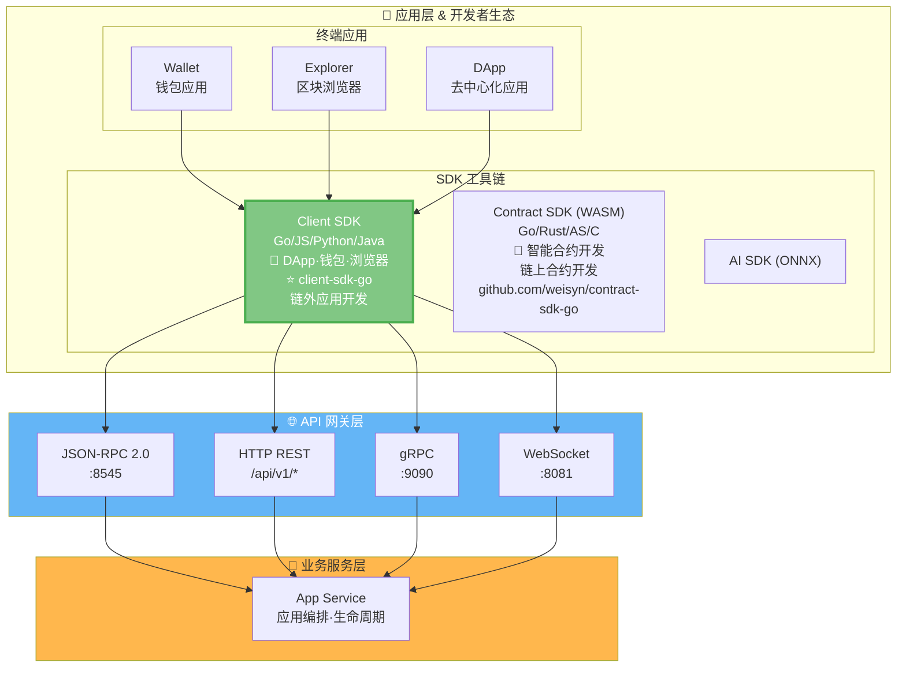
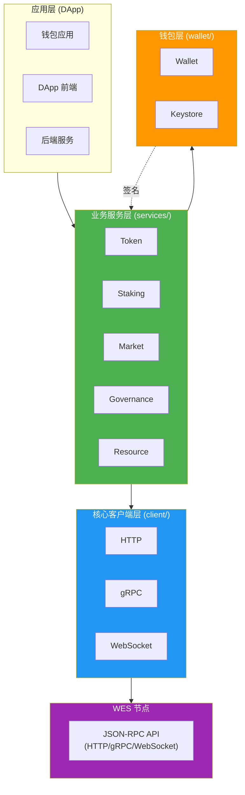
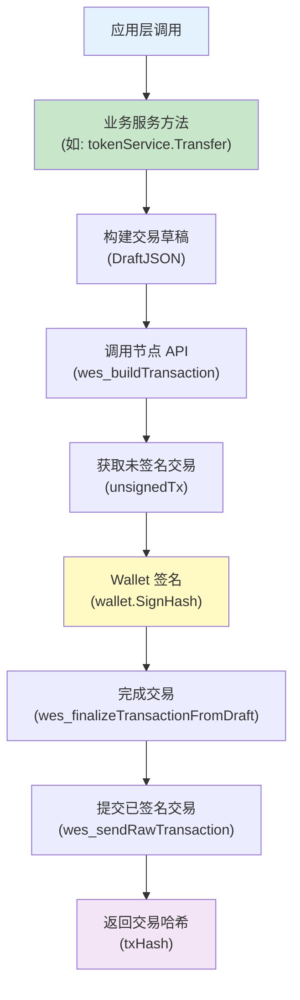

# WES Client SDK for Go

<div align="center">

<pre>
__          ________ _____  _______     ___   _ 
\ \        / /  ____|_   _|/ ____\ \   / / \ | |
 \ \  /\  / /| |__    | | | (___  \ \_/ /|  \| |
  \ \/  \/ / |  __|   | |  \___ \  \   / | . ` |
   \  /\  /  | |____ _| |_ ____) |  | |  | |\  |
    \/  \/   |______|_____|_____/   |_|  |_| \_|
</pre>

**WES 区块链客户端开发工具包 - Go 语言版本**  
**为后端服务、工具链和 DApp 提供完整的 WES 区块链交互能力**

[](https://golang.org)
[](LICENSE)
[](https://goreportcard.com/report/github.com/weisyn/client-sdk-go)
[](https://godoc.org/github.com/weisyn/client-sdk-go)

[🚀 快速开始](#-快速开始) • [📚 文档中心](./docs/README.md) • [💡 核心特性](#-核心特性) • [🏗️ 架构概览](#️-架构概览)

</div>

---

## 📦 简介

WES Client SDK 是一个用于开发 WES 区块链应用的 Go 语言客户端工具包。它提供了与 WES 节点交互的完整接口，支持交易构建、签名、提交以及业务语义封装。

> 💡 **文档导航**：完整的 SDK 文档请查看 [📚 文档中心](./docs/README.md)

> 💡 **Client SDK vs Contract SDK**：
> - **Client SDK**（本仓库）：用于链外应用开发（DApp、钱包、浏览器、后端服务），通过 API 与节点交互
> - **Contract SDK**：用于链上智能合约开发（WASM 合约），运行在 WES 节点上
> 
> 详见：[Contract SDK (Go)](https://github.com/weisyn/contract-sdk-go)

### 核心业务服务

SDK 提供5个完整的业务服务模块：

| 服务 | 功能 | 状态 | 详细文档 |
|------|------|------|---------|
| **Token** | 转账、批量转账、铸造、销毁、余额查询 | ✅ 完整 | [Token 服务文档](docs/modules/services.md#1-token-服务-) |
| **Staking** | 质押、解质押、委托、取消委托、领取奖励 | ✅ 完整 | [Staking 服务文档](docs/modules/services.md#2-staking-服务-) |
| **Market** | AMM 交换、流动性管理、归属计划、托管 | ✅ 完整 | [Market 服务文档](docs/modules/services.md#3-market-服务-) |
| **Governance** | 提案、投票、参数更新 | ✅ 完整 | [Governance 服务文档](docs/modules/services.md#4-governance-服务-) |
| **Resource** | 合约部署、AI 模型部署、静态资源部署、资源查询 | ✅ 完整 | [Resource 服务文档](docs/modules/services.md#5-resource-服务-) |

> 📊 **实现状态报告**：所有服务均已完整实现，详见 [能力报告](docs/reports/FINAL_CAPABILITY_REPORT.md)

### 核心特性

- ✅ **完整 API 封装** - 封装 HTTP/gRPC/WebSocket 调用
- ✅ **业务语义服务** - 提供 Token、Staking、Market、Governance、Resource 等5个完整业务服务
- ✅ **交易构建与签名** - 完整的离线/在线交易构建与签名流程
- ✅ **事件订阅** - 支持实时事件订阅（WebSocket）
- ✅ **密钥管理** - 安全的密钥管理和钱包功能
- ✅ **多协议支持** - HTTP、gRPC、WebSocket 三种传输协议
- ✅ **完全独立** - 不依赖任何 WES 内部包，可独立发布

### 架构理念

**WES 协议层提供基础能力，SDK 层实现业务语义**：

- **WES 协议层**：提供固化的基础能力
  - 2种输入模式（AssetInput、ResourceInput）
  - 3种输出类型（AssetOutput、StateOutput、ResourceOutput）
  - 7种锁定条件（SingleKey、MultiKey、Contract、Delegation、Threshold、Time、Height）
  
- **SDK 层**：将基础能力组合成业务语义
  - 转账、质押、投票等业务操作 = 输入输出和锁定条件的组合
  - 所有业务语义都在 SDK 层实现，不依赖节点业务服务 API

> 📖 **详细说明**：详见 [设计原则 - 业务语义在 SDK 层](#2-业务语义在-sdk-层) | [架构边界文档](docs/architecture_boundary.md)

## 🏗️ 架构概览

> 📖 **完整架构文档**：详见 [架构设计文档](docs/architecture.md) | [架构边界文档](docs/architecture_boundary.md)

### 在 WES 7 层架构中的位置

`client-sdk-go` 位于 WES 系统的**应用层 & 开发者生态**中的 **SDK 工具链**，通过 **API 网关层**与 WES 节点交互：



> 📖 **完整 WES 架构**：详见 [WES 系统架构文档](https://github.com/weisyn/go-weisyn/blob/main/docs/system/architecture/1-STRUCTURE_VIEW.md#-系统分层架构)  
> 📜 **Contract SDK**：用于链上智能合约开发，详见 [Contract SDK (Go)](https://github.com/weisyn/contract-sdk-go)

### SDK 内部分层架构

在 SDK 仓库内部，采用清晰的分层设计：



### 交易流程



### 模块依赖关系

```
client-sdk-go/
│
├── client/          (核心客户端，无依赖)
│   ├── http.go
│   ├── grpc.go
│   └── websocket.go
│
├── services/        (业务服务，依赖 client/)
│   ├── token/
│   ├── staking/
│   ├── market/
│   ├── governance/
│   └── resource/
│
├── wallet/          (钱包功能，无依赖)
│   ├── wallet.go
│   └── keystore.go
│
└── utils/           (工具函数，无依赖)
    └── address.go
```

## 🚀 快速开始

> 📖 **完整快速开始指南**：详见 [快速开始文档](docs/getting-started.md)

### 安装

**安装方式**：SDK 已独立发布，直接使用 Go 模块：

```bash
go get github.com/weisyn/client-sdk-go@latest
```

或使用 `go.mod`：

```go
// go.mod
module your-app

go 1.24

require github.com/weisyn/client-sdk-go v0.0.0
```

### 第一个应用

```go
package main

import (
    "context"
    "fmt"
    "log"
    
    "github.com/weisyn/client-sdk-go/client"
    "github.com/weisyn/client-sdk-go/services/token"
    "github.com/weisyn/client-sdk-go/wallet"
)

func main() {
    // 1. 初始化客户端
    cfg := &client.Config{
        Endpoint: "http://localhost:8545",
        Protocol: client.ProtocolHTTP,
    }
    cli, err := client.NewClient(cfg)
    if err != nil {
        log.Fatal(err)
    }
    defer cli.Close()
    
    // 2. 创建钱包
    w, err := wallet.NewWalletFromPrivateKey("0x...")
    if err != nil {
        log.Fatal(err)
    }
    
    // 3. 创建 Token 服务
    tokenService := token.NewServiceWithWallet(cli, w)
    
    // 4. 执行转账
    fromAddr := w.Address()
    toAddr := []byte{/* 接收方地址 */}
    
    result, err := tokenService.Transfer(context.Background(), &token.TransferRequest{
        From:    fromAddr,
        To:      toAddr,
        Amount:  1000000, // 1 WES (假设 6 位小数)
        TokenID: nil,     // nil 表示原生币
    }, w) // 传入钱包用于签名
    
    if err != nil {
        log.Fatalf("转账失败: %v", err)
    }
    
    fmt.Printf("转账成功！交易哈希: %s\n", result.TxHash)
}
```

> 📖 **更多示例**：详见 [快速开始文档](docs/getting-started.md) | [业务服务文档](docs/modules/services.md)

## 📚 核心概念

### 1. 客户端初始化

SDK 支持三种传输协议：

```go
// HTTP 客户端（最常用）
client := client.NewClient(&client.Config{
    Endpoint: "http://localhost:8545",
    Protocol: client.ProtocolHTTP,
    Timeout:  30,
})

// gRPC 客户端
client := client.NewClient(&client.Config{
    Endpoint: "localhost:9090",
    Protocol: client.ProtocolGRPC,
})

// WebSocket 客户端（用于事件订阅）
client := client.NewClient(&client.Config{
    Endpoint: "ws://localhost:8081",
    Protocol: client.ProtocolWebSocket,
})
```

### 2. 业务服务

所有业务服务都遵循相同的设计模式：

```
服务接口
    ↓
服务实现 (依赖 client.Client)
    ↓
业务逻辑 (构建交易、调用 API)
    ↓
Wallet 签名
    ↓
提交交易
```

#### Token 服务

```go
tokenService := token.NewService(client)

// 单笔转账
result, err := tokenService.Transfer(ctx, &token.TransferRequest{
    From:   fromAddr,
    To:     toAddr,
    Amount: 1000,
    TokenID: nil, // nil = 原生币
}, wallet)

// 批量转账（所有转账必须使用同一个 tokenID）
result, err := tokenService.BatchTransfer(ctx, &token.BatchTransferRequest{
    From: fromAddr,
    Transfers: []token.TransferItem{
        {To: addr1, Amount: 100, TokenID: tokenID},
        {To: addr2, Amount: 200, TokenID: tokenID}, // 必须相同
    },
}, wallet)

// 代币铸造
result, err := tokenService.Mint(ctx, &token.MintRequest{
    To:       recipientAddr,
    Amount:   10000,
    TokenID:  tokenID,
    ContractAddr: contractAddr,
}, wallet)

// 代币销毁
result, err := tokenService.Burn(ctx, &token.BurnRequest{
    From:   fromAddr,
    Amount: 500,
    TokenID: tokenID,
}, wallet)

// 查询余额
balance, err := tokenService.GetBalance(ctx, address, tokenID)
```

> 📖 **详细文档**：[Token 服务完整文档](docs/modules/services.md#1-token-服务-)

#### Staking 服务

```go
stakingService := staking.NewService(client)

// 质押
result, err := stakingService.Stake(ctx, &staking.StakeRequest{
    From:     stakerAddr,
    Amount:   10000,
    Validator: validatorAddr,
}, wallet)

// 解质押
result, err := stakingService.Unstake(ctx, &staking.UnstakeRequest{
    From:     stakerAddr,
    Amount:   5000,
    Validator: validatorAddr,
}, wallet)

// 委托
result, err := stakingService.Delegate(ctx, &staking.DelegateRequest{
    From:     delegatorAddr,
    Amount:   5000,
    Validator: validatorAddr,
}, wallet)

// 领取奖励
result, err := stakingService.ClaimReward(ctx, &staking.ClaimRewardRequest{
    From:     stakerAddr,
    Validator: validatorAddr,
}, wallet)
```

> 📖 **详细文档**：[Staking 服务完整文档](docs/modules/services.md#2-staking-服务-)

#### Market 服务

```go
marketService := market.NewService(client)

// AMM 代币交换
result, err := marketService.SwapAMM(ctx, &market.SwapAMMRequest{
    ContractAddr: ammContractAddr,
    TokenIn:      tokenIn,
    AmountIn:     1000,
    TokenOut:     tokenOut,
    MinAmountOut: 900, // 最小输出量（滑点保护）
}, wallet)

// 添加流动性
result, err := marketService.AddLiquidity(ctx, &market.AddLiquidityRequest{
    ContractAddr: ammContractAddr,
    TokenA:       tokenA,
    AmountA:      1000,
    TokenB:       tokenB,
    AmountB:      2000,
}, wallet)

// 创建归属计划
result, err := marketService.CreateVesting(ctx, &market.CreateVestingRequest{
    Beneficiary: beneficiaryAddr,
    TokenID:     tokenID,
    TotalAmount: 10000,
    StartTime:   startTime,
    Duration:    365 * 24 * 3600, // 1年
}, wallet)

// 创建托管
result, err := marketService.CreateEscrow(ctx, &market.CreateEscrowRequest{
    Buyer:    buyerAddr,
    Seller:   sellerAddr,
    TokenID:  tokenID,
    Amount:   1000,
    Deadline: deadline,
}, wallet)
```

> 📖 **详细文档**：[Market 服务完整文档](docs/modules/services.md#3-market-服务-)

#### Governance 服务

```go
governanceService := governance.NewService(client)

// 创建提案
result, err := governanceService.Propose(ctx, &governance.ProposeRequest{
    Title:   "提案标题",
    Content: "提案内容",
    Type:    governance.ProposalTypeParameterChange,
}, wallet)

// 投票
result, err := governanceService.Vote(ctx, &governance.VoteRequest{
    ProposalID: proposalID,
    Support:   true, // true = 支持, false = 反对
}, wallet)

// 更新参数
result, err := governanceService.UpdateParam(ctx, &governance.UpdateParamRequest{
    Key:   "min_stake_amount",
    Value: "10000",
}, wallet)
```

> 📖 **详细文档**：[Governance 服务完整文档](docs/modules/services.md#4-governance-服务-)

#### Resource 服务

```go
resourceService := resource.NewService(client)

// 部署智能合约
result, err := resourceService.DeployContract(ctx, &resource.DeployContractRequest{
    WasmBytes: wasmBytes,
    Name:      "My Contract",
}, wallet)

// 部署 AI 模型
result, err := resourceService.DeployAIModel(ctx, &resource.DeployAIModelRequest{
    ModelBytes: onnxBytes,
    Name:       "My AI Model",
    Framework:  "ONNX",
}, wallet)

// 部署静态资源
result, err := resourceService.DeployStaticResource(ctx, &resource.DeployStaticResourceRequest{
    Content:     fileBytes,
    ContentType: "image/png",
    Name:        "My Image",
}, wallet)

// 查询资源信息（不需要 Wallet）
info, err := resourceService.GetResource(ctx, contentHash)
```

> 📖 **详细文档**：[Resource 服务完整文档](docs/modules/services.md#5-resource-服务-)

### 3. 钱包功能

```go
// 创建新钱包
wallet, err := wallet.NewWallet()
if err != nil {
    log.Fatal(err)
}

// 从私钥创建钱包
wallet, err := wallet.NewWalletFromPrivateKey("0x...")
if err != nil {
    log.Fatal(err)
}

// 获取地址
address := wallet.Address() // 20 字节地址

// 签名交易
signedTx, err := wallet.SignTransaction(unsignedTxBytes)

// 签名消息
signature, err := wallet.SignMessage(messageBytes)
```

> 📖 **详细文档**：[钱包功能完整文档](docs/modules/wallet.md)

### 4. 事件订阅

```go
// 使用 WebSocket 客户端订阅事件
wsClient, _ := client.NewClient(&client.Config{
    Endpoint: "ws://localhost:8081",
    Protocol: client.ProtocolWebSocket,
})

events, err := wsClient.Subscribe(ctx, &client.EventFilter{
    Topics: []string{"Transfer", "Mint"},
    From:   fromAddr,
    To:     toAddr,
})

for event := range events {
    fmt.Printf("收到事件: %s, 数据: %x\n", event.Topic, event.Data)
}
```

> 📖 **详细文档**：[架构文档](docs/architecture.md) | [快速开始指南](docs/getting-started.md)

## 🏗️ 目录结构

```
client-sdk-go/
│
├── client/              # 核心客户端层
│   ├── client.go        # Client 接口定义
│   ├── config.go        # 配置管理
│   ├── errors.go        # 错误定义
│   ├── http.go          # HTTP 客户端实现 ✅
│   ├── grpc.go          # gRPC 客户端实现 ✅
│   └── websocket.go     # WebSocket 客户端实现 ✅
│
├── services/            # 业务服务层
│   ├── token/           # Token 服务 ✅
│   │   ├── service.go
│   │   ├── transfer.go  # 转账实现
│   │   ├── mint.go       # 铸造实现
│   │   ├── balance.go    # 余额查询
│   │   └── tx_builder.go # 交易构建
│   │
│   ├── staking/         # Staking 服务 ✅
│   ├── market/          # Market 服务 ✅
│   ├── governance/      # Governance 服务 ✅
│   └── resource/        # Resource 服务 ✅
│
├── wallet/              # 钱包功能 ✅
│   ├── wallet.go        # Wallet 接口和实现
│   ├── keystore.go      # Keystore 管理器
│   └── README.md        # 钱包文档
│
├── utils/               # 工具函数
│   └── address.go       # 地址转换工具 ✅
│
├── examples/            # 示例代码
│   └── simple-transfer/
│       └── main.go
│
├── go.mod
├── go.sum
└── README.md           # 本文档
```

> 📖 **完整目录结构说明**：详见 [架构文档](docs/architecture.md#-sdk-内部分层架构)

## 📖 文档

### 快速开始
- **[快速开始指南](./docs/getting-started.md)** - 安装、配置、第一个示例
- **[概述](./docs/overview.md)** - SDK 视角的 WES 核心概念

### 完整文档
- **[📚 文档中心](./docs/README.md)** - 完整的文档导航
- **[API 参考](./docs/api/)** - 完整的 API 文档（待完善）
- **[使用指南](./docs/guides/)** - 业务场景使用指南（待完善）
- **[参考文档](./docs/reference/)** - 工具和最佳实践（待完善）

### 其他
- **[测试指南](./docs/testing.md)** - 单元测试和集成测试（待完善）
- **[故障排查](./docs/troubleshooting.md)** - 常见问题和解决方案（待完善）

---

## 📖 API 文档（旧版，待迁移）

### Client 接口

```go
type Client interface {
    // Call 调用 JSON-RPC 方法
    Call(ctx context.Context, method string, params interface{}) (interface{}, error)
    
    // SendRawTransaction 发送已签名的原始交易
    SendRawTransaction(ctx context.Context, signedTxHex string) (*SendTxResult, error)
    
    // Subscribe 订阅事件（WebSocket 支持）
    Subscribe(ctx context.Context, filter *EventFilter) (<-chan *Event, error)
    
    // Close 关闭连接
    Close() error
}
```

### 业务服务接口

#### Token Service ✅

```go
type Service interface {
    // Transfer 单笔转账 ✅
    Transfer(ctx context.Context, req *TransferRequest, wallets ...wallet.Wallet) (*TransferResult, error)
    
    // BatchTransfer 批量转账 ✅（所有转账必须使用同一个 tokenID）
    BatchTransfer(ctx context.Context, req *BatchTransferRequest, wallets ...wallet.Wallet) (*BatchTransferResult, error)
    
    // Mint 代币铸造 ✅
    Mint(ctx context.Context, req *MintRequest, wallets ...wallet.Wallet) (*MintResult, error)
    
    // Burn 代币销毁 ✅
    Burn(ctx context.Context, req *BurnRequest, wallets ...wallet.Wallet) (*BurnResult, error)
    
    // GetBalance 查询余额 ✅
    GetBalance(ctx context.Context, address []byte, tokenID []byte) (uint64, error)
}
```

#### Staking Service ✅

```go
type Service interface {
    // Stake 质押代币 ✅
    Stake(ctx context.Context, req *StakeRequest, wallets ...wallet.Wallet) (*StakeResult, error)
    
    // Unstake 解除质押 ✅
    Unstake(ctx context.Context, req *UnstakeRequest, wallets ...wallet.Wallet) (*UnstakeResult, error)
    
    // Delegate 委托验证者 ✅
    Delegate(ctx context.Context, req *DelegateRequest, wallets ...wallet.Wallet) (*DelegateResult, error)
    
    // Undelegate 取消委托 ✅
    Undelegate(ctx context.Context, req *UndelegateRequest, wallets ...wallet.Wallet) (*UndelegateResult, error)
    
    // ClaimReward 领取奖励 ✅
    ClaimReward(ctx context.Context, req *ClaimRewardRequest, wallets ...wallet.Wallet) (*ClaimRewardResult, error)
}
```

#### Market Service ✅

```go
type Service interface {
    // SwapAMM AMM 代币交换 ✅
    SwapAMM(ctx context.Context, req *SwapAMMRequest, wallets ...wallet.Wallet) (*SwapAMMResult, error)
    
    // AddLiquidity 添加流动性 ✅
    AddLiquidity(ctx context.Context, req *AddLiquidityRequest, wallets ...wallet.Wallet) (*AddLiquidityResult, error)
    
    // RemoveLiquidity 移除流动性 ✅
    RemoveLiquidity(ctx context.Context, req *RemoveLiquidityRequest, wallets ...wallet.Wallet) (*RemoveLiquidityResult, error)
    
    // CreateVesting 创建归属计划 ✅
    CreateVesting(ctx context.Context, req *CreateVestingRequest, wallets ...wallet.Wallet) (*CreateVestingResult, error)
    
    // ClaimVesting 领取归属代币 ✅
    ClaimVesting(ctx context.Context, req *ClaimVestingRequest, wallets ...wallet.Wallet) (*ClaimVestingResult, error)
    
    // CreateEscrow 创建托管 ✅
    CreateEscrow(ctx context.Context, req *CreateEscrowRequest, wallets ...wallet.Wallet) (*CreateEscrowResult, error)
    
    // ReleaseEscrow 释放托管 ✅
    ReleaseEscrow(ctx context.Context, req *ReleaseEscrowRequest, wallets ...wallet.Wallet) (*ReleaseEscrowResult, error)
    
    // RefundEscrow 退款托管 ✅
    RefundEscrow(ctx context.Context, req *RefundEscrowRequest, wallets ...wallet.Wallet) (*RefundEscrowResult, error)
}
```

#### Governance Service ✅

```go
type Service interface {
    // Propose 创建提案 ✅
    Propose(ctx context.Context, req *ProposeRequest, wallets ...wallet.Wallet) (*ProposeResult, error)
    
    // Vote 投票 ✅
    Vote(ctx context.Context, req *VoteRequest, wallets ...wallet.Wallet) (*VoteResult, error)
    
    // UpdateParam 更新参数 ✅
    UpdateParam(ctx context.Context, req *UpdateParamRequest, wallets ...wallet.Wallet) (*UpdateParamResult, error)
}
```

#### Resource Service ✅

```go
type Service interface {
    // DeployContract 部署智能合约 ✅
    DeployContract(ctx context.Context, req *DeployContractRequest, wallets ...wallet.Wallet) (*DeployContractResult, error)
    
    // DeployAIModel 部署 AI 模型 ✅
    DeployAIModel(ctx context.Context, req *DeployAIModelRequest, wallets ...wallet.Wallet) (*DeployAIModelResult, error)
    
    // DeployStaticResource 部署静态资源 ✅
    DeployStaticResource(ctx context.Context, req *DeployStaticResourceRequest, wallets ...wallet.Wallet) (*DeployStaticResourceResult, error)
    
    // GetResource 查询资源信息 ✅（不需要 Wallet）
    GetResource(ctx context.Context, contentHash []byte) (*ResourceInfo, error)
}
```

> 📖 **完整 API 文档**：
> - [文档中心](docs/README.md) - 完整文档导航和索引
> - [架构文档](docs/architecture.md) - SDK 架构设计详解
> - [业务服务文档](docs/modules/services.md) - 所有业务服务详细说明
> - [钱包文档](docs/modules/wallet.md) - 钱包功能详细说明
> - [工具模块文档](docs/modules/utils.md) - 工具函数说明
> - [能力报告](docs/reports/FINAL_CAPABILITY_REPORT.md) - 服务实现状态和能力清单

## 🔒 安全考虑

### 1. 密钥管理

```
┌─────────────────────────────────────────┐
│          密钥管理策略                    │
└─────────────────────────────────────────┘

开发环境:
  SimpleWallet (内存存储)
      ↓
  [私钥] → [内存] → [签名]

生产环境:
  Keystore (加密存储)
      ↓
  [私钥] → [PBKDF2] → [AES-256-GCM] → [文件]
      ↓
  [密码] → [验证] → [解密] → [签名]

硬件钱包 (未来):
  [硬件设备] → [安全芯片] → [签名]
```

### 2. 交易签名流程

```
┌─────────────────────────────────────────┐
│        交易签名安全流程                   │
└─────────────────────────────────────────┘

1. 构建未签名交易 (SDK 层)
   └─> 不包含私钥信息

2. Wallet 签名 (客户端)
   └─> 私钥不离开钱包

3. 提交已签名交易 (API)
   └─> 节点验证签名

4. 广播到网络
   └─> 交易上链
```

### 3. 连接安全

- ✅ TLS 支持（HTTPS/WSS）
- ✅ 连接池管理
- ✅ 超时控制
- ✅ 重试机制

## 🎯 设计原则

### 1. SDK 独立性

```
┌─────────────────────────────────────────┐
│        SDK 独立性原则                    │
└─────────────────────────────────────────┘

✅ 允许:
  - Go 标准库
  - 第三方通用库 (如 gorilla/websocket)
  - 通过 API 与节点交互

❌ 禁止:
  - github.com/weisyn/v1/pkg/*
  - github.com/weisyn/v1/internal/*
  - 任何 WES 内部包
```

### 2. 业务语义在 SDK 层

**核心架构理念**：WES 协议层提供基础能力，SDK 层实现业务语义。

#### WES 协议层：基础能力（固化不变）

WES 区块链在协议层提供以下**基础能力**，这些能力是固化的、永不改变的：

| 能力类型 | 具体内容 | 说明 |
|---------|---------|------|
| **2种输入模式** | `AssetInput`（资产输入）<br/>`ResourceInput`（资源输入） | 支持消费（Consume）和引用（Reference）两种模式 |
| **3种输出类型** | `AssetOutput`（价值载体）<br/>`StateOutput`（证据载体）<br/>`ResourceOutput`（能力载体） | 三种 UTXO 载体类型，覆盖所有业务场景 |
| **7种锁定条件** | `SingleKeyLock`（单密钥锁）<br/>`MultiKeyLock`（多密钥锁）<br/>`ContractLock`（合约锁）<br/>`DelegationLock`（委托锁）<br/>`ThresholdLock`（阈值锁）<br/>`TimeLock`（时间锁）<br/>`HeightLock`（高度锁） | 统一的访问控制机制 |

**协议层职责**：
- ✅ 验证交易合法性（权限验证、价值守恒）
- ✅ 执行 UTXO 状态转换
- ✅ 提供通用 API（`wes_buildTransaction`、`wes_callContract` 等）
- ❌ **不定义业务语义**（如"转账"、"质押"等概念）

#### SDK 层：业务语义（灵活扩展）

SDK 层负责将 WES 的基础能力**组合**成业务语义：

```
┌─────────────────────────────────────────┐
│        SDK 层：业务语义实现               │
└─────────────────────────────────────────┘

业务操作              →  基础能力组合
─────────────────────────────────────────
tokenService.Transfer()  →  AssetInput + AssetOutput + SingleKeyLock
tokenService.Mint()       →  0 inputs + AssetOutput + ContractLock
stakingService.Stake()    →  AssetInput + AssetOutput + ContractLock + HeightLock
marketService.SwapAMM()   →  AssetInput + AssetOutput + ContractLock (调用合约)
governanceService.Propose() → AssetInput + StateOutput + ThresholdLock
resourceService.DeployContract() → AssetInput + ResourceOutput + SingleKeyLock
```

**SDK 层职责**：
- ✅ 根据业务场景构建 `DraftJSON`（组合输入输出和锁定条件）
- ✅ 调用协议层通用 API
- ✅ 解析交易结果，提取业务数据
- ✅ 提供直观的业务语义接口

#### 架构分层示意

```
┌─────────────────────────────────────────┐
│        SDK 层 (业务语义)                 │
│  tokenService.Transfer()                 │
│  stakingService.Stake()                 │
│  marketService.SwapAMM()                │
│  governanceService.Propose()            │
│  resourceService.DeployContract()       │
└─────────────────────────────────────────┘
              ↓ 构建 DraftJSON
┌─────────────────────────────────────────┐
│        API 层 (通用接口)                 │
│  wes_buildTransaction(draft)            │
│  wes_computeSignatureHashFromDraft()   │
│  wes_finalizeTransactionFromDraft()     │
│  wes_callContract()                     │
│  wes_sendRawTransaction()               │
└─────────────────────────────────────────┘
              ↓ 执行
┌─────────────────────────────────────────┐
│        WES 协议层 (基础能力)             │
│  • 2种输入模式                           │
│  • 3种输出类型                           │
│  • 7种锁定条件                           │
│  • UTXO 状态转换                         │
│  • 权限验证                              │
└─────────────────────────────────────────┘
```

> 📖 **详细说明**：详见 [架构边界文档](docs/architecture_boundary.md) | [实现完成报告](docs/reports/IMPLEMENTATION_COMPLETE.md#架构符合性验证)

## 🐛 调试技巧

### 1. 启用调试模式

```go
client := client.NewClient(&client.Config{
    Endpoint: "http://localhost:8545",
    Debug:    true, // 启用调试日志
})
```

### 2. 查看请求/响应

```go
// 自定义日志器
logger := &MyLogger{}
client := client.NewClient(&client.Config{
    Endpoint: "http://localhost:8545",
    Logger:   logger,
})
```

## 📦 版本兼容性

| SDK 版本 | API 版本 | Go 版本 | 状态 |
|---------|----------|---------|------|
| v1.0.0-alpha | v1.0.0 | 1.24+ | ✅ 开发中 |

## 🤝 贡献

欢迎提交 Issue 和 Pull Request！

## 📄 许可证

Apache-2.0 License

## 🔗 相关资源

### WES 主链

- **[WES 主项目](https://github.com/weisyn/go-weisyn)** - WES 区块链核心实现
  - Go Module: `github.com/weisyn/v1`
  - [主项目 README](https://github.com/weisyn/go-weisyn/blob/main/README.md) - WES 产品说明
  - [系统架构文档](https://github.com/weisyn/go-weisyn/blob/main/docs/system/architecture/1-STRUCTURE_VIEW.md) - WES 7 层架构详解

### WES 生态 SDK

#### Client SDK（链外应用开发）
- **[Client SDK (Go)](https://github.com/weisyn/client-sdk-go)** ⭐ 当前仓库 - 用于链外应用开发（DApp、钱包、浏览器、后端服务）
- **[Client SDK (JS/TS)](https://github.com/weisyn/client-sdk-js)** - JavaScript/TypeScript 版本

#### Contract SDK（链上合约开发）
- **[Contract SDK (Go)](https://github.com/weisyn/contract-sdk-go)** - 用于链上智能合约开发（WASM 合约），支持 Go/Rust/AS/C

> 📖 **区别说明**：
> - **Client SDK**：链外应用通过 JSON-RPC API 与节点交互，不运行在链上
> - **Contract SDK**：智能合约代码运行在链上（WES 节点），通过 HostABI 与链交互

### SDK 对比

| 特性 | Go SDK | JS/TS SDK | 说明 |
|------|--------|-----------|------|
| **语言** | Go | JavaScript/TypeScript | - |
| **环境** | 服务器/CLI | 浏览器/Node.js | - |
| **Token 服务** | ✅ 完整 | ✅ 完整 | 转账、批量转账、铸造、销毁、余额查询 |
| **Staking 服务** | ✅ 完整 | ✅ 完整 | 质押、解质押、委托、取消委托、领取奖励 |
| **Market 服务** | ✅ 完整 | ✅ 完整 | AMM 交换、流动性管理、归属计划、托管 |
| **Governance 服务** | ✅ 完整 | ✅ 完整 | 提案、投票、参数更新 |
| **Resource 服务** | ✅ 完整 | ✅ 完整 | 合约部署、AI 模型部署、静态资源部署、资源查询 |
| **Wallet** | ✅ 完整 | ✅ 完整 | 密钥生成、签名、地址派生 |
| **仓库** | [client-sdk-go](https://github.com/weisyn/client-sdk-go) | [client-sdk-js](https://github.com/weisyn/client-sdk-js) | - |

> 📖 **详细能力对比**：两个 SDK 的能力对比请查看 [Go/JS SDK 能力对比文档](docs/capability-comparison.md)

> 💡 **提示**：两个 SDK 提供相同的业务语义接口，可以根据项目需求选择合适的语言版本。详细对比请参考 [能力对比文档](docs/capability-comparison.md)。

---

**最后更新**: 2025-11-17
