```mermaid
graph TB
    subgraph APP_LAYER["应用层 (DApp)"]
        direction LR
        WALLET_APP["钱包应用"]
        DAPP_FRONT["DApp 前端"]
        BACKEND["后端服务"]
    end
    
    subgraph SERVICES_LAYER["业务服务层 (services/)"]
        direction LR
        TOKEN["Token"]
        STAKING["Staking"]
        MARKET["Market"]
        GOVERNANCE["Governance"]
        RESOURCE["Resource"]
    end
    
    subgraph CLIENT_LAYER["核心客户端层 (client/)"]
        direction LR
        HTTP_CLIENT["HTTP"]
        GRPC_CLIENT["gRPC"]
        WS_CLIENT["WebSocket"]
    end
    
    subgraph WALLET_LAYER["钱包层 (wallet/)"]
        direction LR
        WALLET["Wallet"]
        KEYSTORE["Keystore"]
    end
    
    subgraph NODE["WES 节点"]
        JSONRPC_API["JSON-RPC API<br/>(HTTP/gRPC/WebSocket)"]
    end
    
    APP_LAYER --> SERVICES_LAYER
    SERVICES_LAYER --> CLIENT_LAYER
    SERVICES_LAYER --> WALLET_LAYER
    CLIENT_LAYER --> NODE
    WALLET_LAYER -.签名.-> SERVICES_LAYER
    
    style SERVICES_LAYER fill:#4CAF50,color:#fff
    style CLIENT_LAYER fill:#2196F3,color:#fff
    style WALLET_LAYER fill:#FF9800,color:#fff
    style NODE fill:#9C27B0,color:#fff
```

# WES Client SDK for Go

WES 区块链客户端开发工具包 - Go 语言版本

[](https://golang.org)
[](LICENSE)

## 📦 简介

WES Client SDK 是一个用于开发 WES 区块链应用的 Go 语言客户端工具包。它提供了与 WES 节点交互的完整接口，支持交易构建、签名、提交以及业务语义封装。

> 💡 **Client SDK vs Contract SDK**：
> - **Client SDK**（本仓库）：用于链外应用开发（DApp、钱包、浏览器、后端服务），通过 API 与节点交互
> - **Contract SDK**：用于链上智能合约开发（WASM 合约），运行在 WES 节点上
> 
> 详见：[Contract SDK (Go)](https://github.com/weisyn/contract-sdk-go)

### 核心特性

- ✅ **完整 API 封装** - 封装 HTTP/gRPC/WebSocket 调用
- ✅ **业务语义服务** - 提供 Token、Staking、Market、Governance、Resource 等业务服务
- ✅ **交易构建与签名** - 完整的离线/在线交易构建与签名流程
- ✅ **事件订阅** - 支持实时事件订阅（WebSocket）
- ✅ **密钥管理** - 安全的密钥管理和钱包功能
- ✅ **多协议支持** - HTTP、gRPC、WebSocket 三种传输协议
- ✅ **完全独立** - 不依赖任何 WES 内部包，可独立发布

## 🏗️ 架构概览

### 在 WES 7 层架构中的位置

`client-sdk-go` 位于 WES 系统的**应用层 & 开发者生态**中的 **SDK 工具链**，通过 **API 网关层**与 WES 节点交互：

```mermaid
graph TB
    subgraph DEV_ECOSYSTEM["🎨 应用层 & 开发者生态"]
        direction TB
        subgraph SDK_LAYER["SDK 工具链"]
            direction LR
            CLIENT_SDK["Client SDK<br/>Go/JS/Python/Java<br/>📱 DApp·钱包·浏览器<br/>⭐ client-sdk-go<br/>链外应用开发"]
            CONTRACT_SDK["Contract SDK (WASM)<br/>Go/Rust/AS/C<br/>📜 智能合约开发<br/>链上合约开发<br/>github.com/weisyn/contract-sdk-go"]
            AI_SDK["AI SDK (ONNX)"]
        end
        subgraph END_USER_APPS["终端应用"]
            direction LR
            WALLET_APP["Wallet<br/>钱包应用"]
            EXPLORER["Explorer<br/>区块浏览器"]
            DAPP["DApp<br/>去中心化应用"]
        end
    end
    
    subgraph API_GATEWAY["🌐 API 网关层"]
        direction LR
        JSONRPC["JSON-RPC 2.0<br/>:8545"]
        HTTP["HTTP REST<br/>/api/v1/*"]
        GRPC["gRPC<br/>:9090"]
        WS["WebSocket<br/>:8081"]
    end
    
    subgraph BIZ_LAYER["💼 业务服务层"]
        APP_SVC["App Service<br/>应用编排·生命周期"]
    end
    
    WALLET_APP --> CLIENT_SDK
    EXPLORER --> CLIENT_SDK
    DAPP --> CLIENT_SDK
    
    CLIENT_SDK --> JSONRPC
    CLIENT_SDK --> HTTP
    CLIENT_SDK --> GRPC
    CLIENT_SDK --> WS
    
    JSONRPC --> APP_SVC
    HTTP --> APP_SVC
    GRPC --> APP_SVC
    WS --> APP_SVC
    
    style CLIENT_SDK fill:#81C784,color:#fff,stroke:#4CAF50,stroke-width:3px
    style API_GATEWAY fill:#64B5F6,color:#fff
    style BIZ_LAYER fill:#FFB74D,color:#333
```



> 📖 **完整 WES 架构**：详见 [WES 系统架构文档](https://github.com/weisyn/go-weisyn/blob/main/docs/system/architecture/1-STRUCTURE_VIEW.md#-系统分层架构)  
> 📜 **Contract SDK**：用于链上智能合约开发，详见 [Contract SDK (Go)](https://github.com/weisyn/contract-sdk-go)

### SDK 内部分层架构

在 SDK 仓库内部，采用清晰的分层设计：



### 交易流程

```mermaid
graph TD
    APP["应用层调用"] --> SERVICE["业务服务方法<br/>(如: tokenService.Transfer)"]
    SERVICE --> DRAFT["构建交易草稿<br/>(DraftJSON)"]
    DRAFT --> API["调用节点 API<br/>(wes_buildTransaction)"]
    API --> UNSIGNED["获取未签名交易<br/>(unsignedTx)"]
    UNSIGNED --> SIGN["Wallet 签名<br/>(wallet.SignHash)"]
    SIGN --> FINALIZE["完成交易<br/>(wes_finalizeTransactionFromDraft)"]
    FINALIZE --> SEND["提交已签名交易<br/>(wes_sendRawTransaction)"]
    SEND --> RESULT["返回交易哈希<br/>(txHash)"]
    
    style APP fill:#E3F2FD
    style SERVICE fill:#C8E6C9
    style SIGN fill:#FFF9C4
    style RESULT fill:#F3E5F5
```



### 模块依赖关系

```
client-sdk-go/
│
├── client/          (核心客户端，无依赖)
│   ├── http.go
│   ├── grpc.go
│   └── websocket.go
│
├── services/        (业务服务，依赖 client/)
│   ├── token/
│   ├── staking/
│   ├── market/
│   ├── governance/
│   └── resource/
│
├── wallet/          (钱包功能，无依赖)
│   ├── wallet.go
│   └── keystore.go
│
└── utils/           (工具函数，无依赖)
    └── address.go
```

## 🚀 快速开始

### 安装

**当前开发阶段**：SDK 在主仓库 `_sdks/` 下孵化，使用本地路径：

```go
// go.mod
module your-app

go 1.24

replace github.com/weisyn/client-sdk-go => ../path/to/_sdks/client-sdk-go

require github.com/weisyn/client-sdk-go v0.0.0
```

**未来正式发布后**：

```bash
go get github.com/weisyn/client-sdk-go@latest
```

### 第一个应用

```go
package main

import (
    "context"
    "fmt"
    "log"
    
    "github.com/weisyn/client-sdk-go/client"
    "github.com/weisyn/client-sdk-go/services/token"
    "github.com/weisyn/client-sdk-go/wallet"
)

func main() {
    // 1. 初始化客户端
    cfg := &client.Config{
        Endpoint: "http://localhost:8545",
        Protocol: client.ProtocolHTTP,
    }
    cli, err := client.NewClient(cfg)
    if err != nil {
        log.Fatal(err)
    }
    defer cli.Close()
    
    // 2. 创建钱包
    w, err := wallet.NewWalletFromPrivateKey("0x...")
    if err != nil {
        log.Fatal(err)
    }
    
    // 3. 创建 Token 服务
    tokenService := token.NewServiceWithWallet(cli, w)
    
    // 4. 执行转账
    fromAddr := w.Address()
    toAddr := []byte{/* 接收方地址 */}
    
    result, err := tokenService.Transfer(context.Background(), &token.TransferRequest{
        From:    fromAddr,
        To:      toAddr,
        Amount:  1000000, // 1 WES (假设 6 位小数)
        TokenID: nil,     // nil 表示原生币
    }, w) // 传入钱包用于签名
    
    if err != nil {
        log.Fatalf("转账失败: %v", err)
    }
    
    fmt.Printf("转账成功！交易哈希: %s\n", result.TxHash)
}
```

## 📚 核心概念

### 1. 客户端初始化

SDK 支持三种传输协议：

```go
// HTTP 客户端（最常用）
client := client.NewClient(&client.Config{
    Endpoint: "http://localhost:8545",
    Protocol: client.ProtocolHTTP,
    Timeout:  30,
})

// gRPC 客户端
client := client.NewClient(&client.Config{
    Endpoint: "localhost:9090",
    Protocol: client.ProtocolGRPC,
})

// WebSocket 客户端（用于事件订阅）
client := client.NewClient(&client.Config{
    Endpoint: "ws://localhost:8081",
    Protocol: client.ProtocolWebSocket,
})
```

### 2. 业务服务

所有业务服务都遵循相同的设计模式：

```
服务接口
    ↓
服务实现 (依赖 client.Client)
    ↓
业务逻辑 (构建交易、调用 API)
    ↓
Wallet 签名
    ↓
提交交易
```

#### Token 服务

```go
tokenService := token.NewService(client)

// 单笔转账
result, err := tokenService.Transfer(ctx, &token.TransferRequest{
    From:   fromAddr,
    To:     toAddr,
    Amount: 1000,
    TokenID: nil, // nil = 原生币
}, wallet)

// 批量转账（所有转账必须使用同一个 tokenID）
result, err := tokenService.BatchTransfer(ctx, &token.BatchTransferRequest{
    From: fromAddr,
    Transfers: []token.TransferItem{
        {To: addr1, Amount: 100, TokenID: tokenID},
        {To: addr2, Amount: 200, TokenID: tokenID}, // 必须相同
    },
}, wallet)

// 代币铸造
result, err := tokenService.Mint(ctx, &token.MintRequest{
    To:       recipientAddr,
    Amount:   10000,
    TokenID:  tokenID,
    ContractAddr: contractAddr,
}, wallet)

// 代币销毁
result, err := tokenService.Burn(ctx, &token.BurnRequest{
    From:   fromAddr,
    Amount: 500,
    TokenID: tokenID,
}, wallet)

// 查询余额
balance, err := tokenService.GetBalance(ctx, address, tokenID)
```

#### Staking 服务

```go
stakingService := staking.NewService(client)

// 质押
result, err := stakingService.Stake(ctx, &staking.StakeRequest{
    From:     stakerAddr,
    Amount:   10000,
    Validator: validatorAddr,
}, wallet)

// 解质押
result, err := stakingService.Unstake(ctx, &staking.UnstakeRequest{
    From:     stakerAddr,
    Amount:   5000,
    Validator: validatorAddr,
}, wallet)
```

### 3. 钱包功能

```go
// 创建新钱包
wallet, err := wallet.NewWallet()
if err != nil {
    log.Fatal(err)
}

// 从私钥创建钱包
wallet, err := wallet.NewWalletFromPrivateKey("0x...")
if err != nil {
    log.Fatal(err)
}

// 获取地址
address := wallet.Address() // 20 字节地址

// 签名交易
signedTx, err := wallet.SignTransaction(unsignedTxBytes)

// 签名消息
signature, err := wallet.SignMessage(messageBytes)
```

### 4. 事件订阅

```go
// 使用 WebSocket 客户端订阅事件
wsClient, _ := client.NewClient(&client.Config{
    Endpoint: "ws://localhost:8081",
    Protocol: client.ProtocolWebSocket,
})

events, err := wsClient.Subscribe(ctx, &client.EventFilter{
    Topics: []string{"Transfer", "Mint"},
    From:   fromAddr,
    To:     toAddr,
})

for event := range events {
    fmt.Printf("收到事件: %s, 数据: %x\n", event.Topic, event.Data)
}
```

## 🏗️ 目录结构

```
client-sdk-go/
│
├── client/              # 核心客户端层
│   ├── client.go        # Client 接口定义
│   ├── config.go        # 配置管理
│   ├── errors.go        # 错误定义
│   ├── http.go          # HTTP 客户端实现 ✅
│   ├── grpc.go          # gRPC 客户端实现 ✅
│   └── websocket.go     # WebSocket 客户端实现 ✅
│
├── services/            # 业务服务层
│   ├── token/           # Token 服务 ✅
│   │   ├── service.go
│   │   ├── transfer.go  # 转账实现
│   │   ├── mint.go       # 铸造实现
│   │   ├── balance.go    # 余额查询
│   │   └── tx_builder.go # 交易构建
│   │
│   ├── staking/         # Staking 服务 ✅
│   ├── market/          # Market 服务 ✅
│   ├── governance/      # Governance 服务 ✅
│   └── resource/        # Resource 服务 ✅
│
├── wallet/              # 钱包功能 ✅
│   ├── wallet.go        # Wallet 接口和实现
│   ├── keystore.go      # Keystore 管理器
│   └── README.md        # 钱包文档
│
├── utils/               # 工具函数
│   └── address.go       # 地址转换工具 ✅
│
├── examples/            # 示例代码
│   └── simple-transfer/
│       └── main.go
│
├── go.mod
├── go.sum
└── README.md           # 本文档
```

## 📖 API 文档

### Client 接口

```go
type Client interface {
    // Call 调用 JSON-RPC 方法
    Call(ctx context.Context, method string, params interface{}) (interface{}, error)
    
    // SendRawTransaction 发送已签名的原始交易
    SendRawTransaction(ctx context.Context, signedTxHex string) (*SendTxResult, error)
    
    // Subscribe 订阅事件（WebSocket 支持）
    Subscribe(ctx context.Context, filter *EventFilter) (<-chan *Event, error)
    
    // Close 关闭连接
    Close() error
}
```

### Token Service

```go
type Service interface {
    // Transfer 单笔转账 ✅
    Transfer(ctx context.Context, req *TransferRequest, wallets ...wallet.Wallet) (*TransferResult, error)
    
    // BatchTransfer 批量转账 ✅（所有转账必须使用同一个 tokenID）
    BatchTransfer(ctx context.Context, req *BatchTransferRequest, wallets ...wallet.Wallet) (*BatchTransferResult, error)
    
    // Mint 代币铸造 ✅
    Mint(ctx context.Context, req *MintRequest, wallets ...wallet.Wallet) (*MintResult, error)
    
    // Burn 代币销毁 ✅
    Burn(ctx context.Context, req *BurnRequest, wallets ...wallet.Wallet) (*BurnResult, error)
    
    // GetBalance 查询余额 ✅
    GetBalance(ctx context.Context, address []byte, tokenID []byte) (uint64, error)
}
```

详细 API 文档请参考：
- [文档中心](docs/README.md) - 完整文档导航
- [架构文档](docs/architecture.md) - 架构设计详解
- [业务服务文档](docs/modules/services.md) - 业务服务层详细说明
- [钱包文档](docs/modules/wallet.md) - 钱包功能详细说明

## 🔒 安全考虑

### 1. 密钥管理

```
┌─────────────────────────────────────────┐
│          密钥管理策略                    │
└─────────────────────────────────────────┘

开发环境:
  SimpleWallet (内存存储)
      ↓
  [私钥] → [内存] → [签名]

生产环境:
  Keystore (加密存储)
      ↓
  [私钥] → [PBKDF2] → [AES-256-GCM] → [文件]
      ↓
  [密码] → [验证] → [解密] → [签名]

硬件钱包 (未来):
  [硬件设备] → [安全芯片] → [签名]
```

### 2. 交易签名流程

```
┌─────────────────────────────────────────┐
│        交易签名安全流程                   │
└─────────────────────────────────────────┘

1. 构建未签名交易 (SDK 层)
   └─> 不包含私钥信息

2. Wallet 签名 (客户端)
   └─> 私钥不离开钱包

3. 提交已签名交易 (API)
   └─> 节点验证签名

4. 广播到网络
   └─> 交易上链
```

### 3. 连接安全

- ✅ TLS 支持（HTTPS/WSS）
- ✅ 连接池管理
- ✅ 超时控制
- ✅ 重试机制

## 🎯 设计原则

### 1. SDK 独立性

```
┌─────────────────────────────────────────┐
│        SDK 独立性原则                    │
└─────────────────────────────────────────┘

✅ 允许:
  - Go 标准库
  - 第三方通用库 (如 gorilla/websocket)
  - 通过 API 与节点交互

❌ 禁止:
  - github.com/weisyn/v1/pkg/*
  - github.com/weisyn/v1/internal/*
  - 任何 WES 内部包
```

### 2. 业务语义在 SDK 层

```
┌─────────────────────────────────────────┐
│        架构分层原则                      │
└─────────────────────────────────────────┘

SDK 层 (业务语义)
  ├─> tokenService.Transfer()
  ├─> tokenService.Mint()
  └─> stakingService.Stake()
       ↓ 调用
API 层 (通用接口)
  ├─> wes_buildTransaction
  ├─> wes_callContract
  └─> wes_sendRawTransaction
       ↓ 调用
ISPC 层 (执行引擎)
  └─> ExecuteWASMContract (纯执行)
```

## 🐛 调试技巧

### 1. 启用调试模式

```go
client := client.NewClient(&client.Config{
    Endpoint: "http://localhost:8545",
    Debug:    true, // 启用调试日志
})
```

### 2. 查看请求/响应

```go
// 自定义日志器
logger := &MyLogger{}
client := client.NewClient(&client.Config{
    Endpoint: "http://localhost:8545",
    Logger:   logger,
})
```

## 📦 版本兼容性

| SDK 版本 | API 版本 | Go 版本 | 状态 |
|---------|----------|---------|------|
| v1.0.0-alpha | v1.0.0 | 1.24+ | ✅ 开发中 |

## 🤝 贡献

欢迎提交 Issue 和 Pull Request！

## 📄 许可证

Apache-2.0 License

## 🔗 相关资源

### WES 主链

- **[WES 主项目](https://github.com/weisyn/go-weisyn)** - WES 区块链核心实现
  - Go Module: `github.com/weisyn/v1`
  - [主项目 README](https://github.com/weisyn/go-weisyn/blob/main/README.md) - WES 产品说明
  - [系统架构文档](https://github.com/weisyn/go-weisyn/blob/main/docs/system/architecture/1-STRUCTURE_VIEW.md) - WES 7 层架构详解

### WES 生态 SDK

#### Client SDK（链外应用开发）
- **[Client SDK (Go)](https://github.com/weisyn/client-sdk-go)** ⭐ 当前仓库 - 用于链外应用开发（DApp、钱包、浏览器、后端服务）
- **[Client SDK (JS/TS)](https://github.com/weisyn/client-sdk-js)** - JavaScript/TypeScript 版本

#### Contract SDK（链上合约开发）
- **[Contract SDK (Go)](https://github.com/weisyn/contract-sdk-go)** - 用于链上智能合约开发（WASM 合约），支持 Go/Rust/AS/C

> 📖 **区别说明**：
> - **Client SDK**：链外应用通过 JSON-RPC API 与节点交互，不运行在链上
> - **Contract SDK**：智能合约代码运行在链上（WES 节点），通过 HostABI 与链交互

### SDK 对比

| 特性 | Go SDK | JS/TS SDK | 说明 |
|------|--------|-----------|------|
| **语言** | Go | JavaScript/TypeScript | - |
| **环境** | Node.js/服务器 | 浏览器/Node.js | - |
| **Token 服务** | ✅ 完整 | ✅ 完整 | 转账、批量转账、铸造、销毁、余额查询 |
| **Wallet** | ✅ 完整 | ✅ 完整 | 密钥生成、签名、地址派生 |
| **Staking** | ⚠️ 骨架 | ⚠️ 骨架 | 接口完整，待节点 API 支持 |
| **Market** | ⚠️ 骨架 | ⚠️ 骨架 | 接口完整，待节点 API 支持 |
| **Governance** | ⚠️ 骨架 | ⚠️ 骨架 | 接口完整，待节点 API 支持 |
| **Resource** | ⚠️ 部分 | ⚠️ 部分 | 查询已实现，部署待完善 |
| **仓库** | [client-sdk-go](https://github.com/weisyn/client-sdk-go) | [client-sdk-js](https://github.com/weisyn/client-sdk-js) | - |

> ⚠️ **说明**：`⚠️ 骨架` 表示接口和类型定义完整，但实际实现需要节点提供对应的 JSON-RPC API。详细状态分析请参考 JS/TS SDK 的 [SDK 状态分析文档](https://github.com/weisyn/client-sdk-js/blob/main/docs/SDK_STATUS_ANALYSIS.md)。

> 💡 **提示**：两个 SDK 提供相同的业务语义接口，可以根据项目需求选择合适的语言版本。

---

**最后更新**: 2025-11-17
