# WES Client SDK for Go

<div align="center">

<pre>
__          ________ _____  _______     ___   _ 
\ \        / /  ____|_   _|/ ____\ \   / / \ | |
 \ \  /\  / /| |__    | | | (___  \ \_/ /|  \| |
  \ \/  \/ / |  __|   | |  \___ \  \   / | . ` |
   \  /\  /  | |____ _| |_ ____) |  | |  | |\  |
    \/  \/   |______|_____|_____/   |_|  |_| \_|
</pre>

**WES 区块链客户端开发工具包 - Go 语言版本**  
**为后端服务、工具链和 DApp 提供完整的 WES 区块链交互能力**

[](https://golang.org)
[](LICENSE)
[](https://goreportcard.com/report/github.com/weisyn/client-sdk-go)
[](https://godoc.org/github.com/weisyn/client-sdk-go)

[🚀 快速开始](#-快速开始) • [🎯 使用场景](#-使用场景) • [💡 核心能力](#-核心能力) • [🏗️ 架构概览](#️-架构概览) • [📚 文档导航](#-文档导航)

</div>

---

## 🌟 它能帮你做什么？

在传统区块链开发中，开发者需要：
- ❌ 理解底层协议细节（UTXO、交易构建、签名等）
- ❌ 手动构建交易（选择输入、创建输出、计算手续费）
- ❌ 处理复杂的业务逻辑组合（转账、授权、质押等）

**WES Client SDK 让这一切成为过去**：

- ✅ **业务语义优先** - 提供 `Transfer()`、`Stake()`、`Vote()` 等直观的业务接口
- ✅ **完整 API 封装** - 封装 HTTP/gRPC/WebSocket 调用
- ✅ **多协议支持** - HTTP、gRPC、WebSocket 三种传输协议
- ✅ **企业级能力** - 支持完整的业务服务（Token、Staking、Market、Governance、Resource）
- ✅ **类型安全** - 完整的类型定义和编译期检查，减少运行时错误

> 💡 **文档导航**：完整的 SDK 文档请查看 [📚 文档中心](./docs/README.md)

> 💡 **Client SDK vs Contract SDK**：
> - **Client SDK**（本仓库）：用于链外应用开发（DApp、钱包、浏览器、后端服务），通过 API 与节点交互
> - **Contract SDK**：用于链上智能合约开发（WASM 合约），运行在 WES 节点上
> 
> 详见：[Contract SDK (Go)](https://github.com/weisyn/contract-sdk-go)

---

## 🚀 快速开始

### 前置要求

- **Go 1.24+** - 用于开发环境

### 安装 SDK

```bash
go get github.com/weisyn/client-sdk-go@latest
```

在 `go.mod` 中：

```go
module your-app

go 1.24

require github.com/weisyn/client-sdk-go v0.0.0
```

### 第一个应用

```go
package main

import (
    "context"
    "fmt"
    "log"
    
    "github.com/weisyn/client-sdk-go/client"
    "github.com/weisyn/client-sdk-go/services/token"
    "github.com/weisyn/client-sdk-go/wallet"
)

func main() {
    // 1. 初始化客户端
    cfg := &client.Config{
        Endpoint: "http://localhost:8545",
        Protocol: client.ProtocolHTTP,
    }
    cli, err := client.NewClient(cfg)
    if err != nil {
        log.Fatal(err)
    }
    defer cli.Close()
    
    // 2. 创建钱包
    w, err := wallet.NewWalletFromPrivateKey("0x...")
    if err != nil {
        log.Fatal(err)
    }
    
    // 3. 创建 Token 服务
    tokenService := token.NewServiceWithWallet(cli, w)
    
    // 4. 执行转账
    result, err := tokenService.Transfer(context.Background(), &token.TransferRequest{
        From:    w.Address(),
        To:      []byte{/* 接收方地址 */},
        Amount:  1000000, // 1 WES (假设 6 位小数)
        TokenID: nil,     // nil 表示原生币
    }, w)
    
    if err != nil {
        log.Fatalf("转账失败: %v", err)
    }
    
    fmt.Printf("转账成功！交易哈希: %s\n", result.TxHash)
}
```

> 📖 **完整指南**：[开发者指南](./docs/DEVELOPER_GUIDE.md) | [快速开始文档](./docs/getting-started.md)

---

## 🎯 使用场景

### 按角色选择使用方式

| 角色 | 推荐使用方式 | 说明 |
|------|------------|------|
| **合约开发者** | `WESClient` + `ResourceService` | 部署合约、查询合约状态、调用合约方法 |
| **Workbench 用户** | `WESClient` + 业务服务（`TokenService`、`StakingService` 等） | 完整的业务操作，包括合约部署、代币操作、质押等 |
| **后端服务** | `WESClient` + 业务服务 | 服务器端应用，需要完整的业务语义支持 |
| **DApp 前端** | `WESClient` + `Wallet` | 浏览器应用，需要钱包集成和用户交互 |
| **工具链开发者** | 底层 `Client` 接口 | 需要直接调用 JSON-RPC 或自定义逻辑 |

> 📖 **详细指南**：
> - [WESClient 使用指南](./docs/examples/wesclient.md) - 类型化 API 使用
> - [业务服务文档](./docs/API_REFERENCE.md) - 完整的业务服务说明
> - [业务场景实现指南](./docs/BUSINESS_SCENARIOS.md) - 如何实现业务场景

---

## 💡 核心能力

### 1. 🎯 WESClient 类型化 API

SDK 提供强类型的 `WESClient` 接口，封装所有核心 RPC 调用：

```go
import "github.com/weisyn/client-sdk-go/client"

// 初始化 WESClient
wesClient := client.NewWESClient(cfg)

// UTXO 操作
utxo, err := wesClient.GetUTXO(ctx, utxoID)
utxos, err := wesClient.BatchGetUTXOs(ctx, utxoIDs)

// 资源操作
resource, err := wesClient.GetResource(ctx, contentHash)

// 交易操作
tx, err := wesClient.GetTransaction(ctx, txHash)
txHash, err := wesClient.SubmitTransaction(ctx, signedTx)
```

> 📖 **详细文档**：[API 参考](./docs/API_REFERENCE.md#wesclient-类型化-api)

### 2. 🔧 业务服务层

SDK 提供完整的业务服务模块，让开发者专注于业务逻辑：

| 服务 | 功能 | 详细文档 |
|------|------|---------|
| **Token** | 转账、批量转账、铸造、销毁、余额查询 | [Token 服务](./docs/API_REFERENCE.md#token-服务) |
| **Staking** | 质押、解质押、委托、取消委托、领取奖励 | [Staking 服务](./docs/API_REFERENCE.md#staking-服务) |
| **Market** | AMM 交换、流动性管理、归属计划、托管 | [Market 服务](./docs/API_REFERENCE.md#market-服务) |
| **Governance** | 提案、投票、参数更新 | [Governance 服务](./docs/API_REFERENCE.md#governance-服务) |
| **Resource** | 合约部署、AI 模型部署、静态资源部署、资源查询 | [Resource 服务](./docs/API_REFERENCE.md#resource-服务) |
| **Permission** | 所有权转移、协作者管理、委托授权、时间/高度锁 | [Permission 服务](./docs/API_REFERENCE.md#permission-服务) |

> 📖 **完整能力矩阵**：详见 [API 参考](./docs/API_REFERENCE.md)

### 3. 🔐 交易构建与签名

完整的离线/在线交易构建与签名流程：

```go
// 业务服务自动处理交易构建
result, err := tokenService.Transfer(ctx, req, wallet)

// SDK 内部流程：
// 1. 构建交易草稿 (DraftJSON)
// 2. 调用节点 API (wes_buildTransaction)
// 3. Wallet 签名
// 4. 完成交易 (wes_finalizeTransactionFromDraft)
// 5. 提交交易 (wes_sendRawTransaction)
```

> 📖 **详细流程**：详见 [开发者指南](./docs/DEVELOPER_GUIDE.md#交易流程)

### 4. 📡 事件订阅 & 钱包

- **事件订阅**：支持实时事件订阅（WebSocket）
- **密钥管理**：安全的密钥管理和钱包功能

> 📖 **详细文档**：详见 [API 参考](./docs/API_REFERENCE.md#事件订阅) | [钱包功能](./docs/API_REFERENCE.md#钱包功能)

---

## 🏗️ 架构概览

> 📖 **完整架构文档**：详见 [SDK 架构文档](./docs/SDK_ARCHITECTURE.md) | [架构规划文档](./docs/ARCHITECTURE_PLAN.md)

### 在 WES 7 层架构中的位置

`client-sdk-go` 位于 WES 系统的**应用层 & 开发者生态**中的 **SDK 工具链**，通过 **API 网关层**与 WES 节点交互：

```mermaid
graph TB
    subgraph DEV_ECOSYSTEM["🎨 应用层 & 开发者生态"]
        direction TB
        subgraph SDK_LAYER["SDK 工具链"]
            direction LR
            CLIENT_SDK["Client SDK<br/>Go/JS/Python/Java<br/>📱 DApp·钱包·浏览器<br/>⭐ client-sdk-go<br/>链外应用开发"]
            CONTRACT_SDK["Contract SDK (WASM)<br/>Go/Rust/AS/C<br/>📜 智能合约开发<br/>链上合约开发<br/>github.com/weisyn/contract-sdk-go"]
            AI_SDK["AI SDK (ONNX)"]
        end
        subgraph END_USER_APPS["终端应用"]
            direction LR
            WALLET_APP["Wallet<br/>钱包应用"]
            EXPLORER["Explorer<br/>区块浏览器"]
            DAPP["DApp<br/>去中心化应用"]
        end
    end
    
    subgraph API_GATEWAY["🌐 API 网关层"]
        direction LR
        JSONRPC["JSON-RPC 2.0<br/>:8545"]
        HTTP["HTTP REST<br/>/api/v1/*"]
        GRPC["gRPC<br/>:9090"]
        WS["WebSocket<br/>:8081"]
    end
    
    subgraph BIZ_LAYER["💼 业务服务层"]
        APP_SVC["App Service<br/>应用编排·生命周期"]
    end
    
    WALLET_APP --> CLIENT_SDK
    EXPLORER --> CLIENT_SDK
    DAPP --> CLIENT_SDK
    
    CLIENT_SDK --> JSONRPC
    CLIENT_SDK --> HTTP
    CLIENT_SDK --> GRPC
    CLIENT_SDK --> WS
    
    JSONRPC --> APP_SVC
    HTTP --> APP_SVC
    GRPC --> APP_SVC
    WS --> APP_SVC
    
    style CLIENT_SDK fill:#81C784,color:#fff,stroke:#4CAF50,stroke-width:3px
    style API_GATEWAY fill:#64B5F6,color:#fff
    style BIZ_LAYER fill:#FFB74D,color:#333
```



> 📖 **完整 WES 架构**：详见 [WES 系统架构文档](https://github.com/weisyn/go-weisyn/blob/main/docs/system/architecture/1-STRUCTURE_VIEW.md#-系统分层架构)  
> 📜 **Contract SDK**：用于链上智能合约开发，详见 [Contract SDK (Go)](https://github.com/weisyn/contract-sdk-go)

### SDK 内部分层架构

SDK 采用分层架构，**应用开发者只需使用业务服务层**：

```mermaid
graph TB
    subgraph APP_LAYER["应用层 (DApp)"]
        direction LR
        WALLET_APP["钱包应用"]
        DAPP_FRONT["DApp 前端"]
        BACKEND["后端服务"]
    end
    
    subgraph SERVICES_LAYER["业务服务层 (services/)"]
        direction LR
        TOKEN["Token"]
        STAKING["Staking"]
        MARKET["Market"]
        GOVERNANCE["Governance"]
        RESOURCE["Resource"]
    end
    
    subgraph CLIENT_LAYER["核心客户端层 (client/)"]
        direction LR
        HTTP_CLIENT["HTTP"]
        GRPC_CLIENT["gRPC"]
        WS_CLIENT["WebSocket"]
    end
    
    subgraph WALLET_LAYER["钱包层 (wallet/)"]
        direction LR
        WALLET["Wallet"]
        KEYSTORE["Keystore"]
    end
    
    subgraph NODE["WES 节点"]
        JSONRPC_API["JSON-RPC API<br/>(HTTP/gRPC/WebSocket)"]
    end
    
    APP_LAYER --> SERVICES_LAYER
    SERVICES_LAYER --> CLIENT_LAYER
    SERVICES_LAYER --> WALLET_LAYER
    CLIENT_LAYER --> NODE
    WALLET_LAYER -.签名.-> SERVICES_LAYER
    
    style SERVICES_LAYER fill:#4CAF50,color:#fff
    style CLIENT_LAYER fill:#2196F3,color:#fff
    style WALLET_LAYER fill:#FF9800,color:#fff
    style NODE fill:#9C27B0,color:#fff
```



**关键原则**：
- ✅ **应用开发者**：只使用 `services` 层的业务语义接口
- ✅ **SDK 职责**：自动处理底层协议细节（交易构建、签名、提交等）
- ❌ **不需要了解**：底层协议实现细节

> 📖 **完整架构和交易流程**：详见 [SDK 架构文档](./docs/SDK_ARCHITECTURE.md)

---

## 📖 文档导航

### 🎯 按角色导航

**👨‍💻 应用开发者**

- [快速开始](#-快速开始) → [开发者指南](./docs/DEVELOPER_GUIDE.md) → [业务场景实现指南](./docs/BUSINESS_SCENARIOS.md)

**🏗️ 架构师/贡献者**

- [架构概览](#-架构概览) → [文档中心](./docs/README.md) → [架构设计文档](./docs/SDK_ARCHITECTURE.md)

**📚 深入理解**

- [API 参考](./docs/API_REFERENCE.md) → [业务场景实现指南](./docs/BUSINESS_SCENARIOS.md)

### 📘 核心文档

| 文档 | 说明 | 受众 |
|------|------|------|
| ⭐ **[主 README](./README.md)** | SDK 总览和快速开始 | 所有用户 |
| 📖 **[文档中心](./docs/README.md)** | 完整文档索引和导航 | 所有用户 |
| 🚀 **[开发者指南](./docs/DEVELOPER_GUIDE.md)** | 如何使用 SDK 开发应用 | 应用开发者 |
| 📚 **[API 参考](./docs/API_REFERENCE.md)** | SDK 接口详细说明 | 应用开发者 |
| 🎯 **[业务场景实现指南](./docs/BUSINESS_SCENARIOS.md)** | 如何实现业务场景 | 应用开发者 |
| 🏗️ **[架构设计文档](./docs/SDK_ARCHITECTURE.md)** | SDK 架构设计讨论 | 架构师/贡献者 |

### 🔗 模块文档

- **[WESClient 使用示例](./docs/examples/wesclient.md)** - 类型化 API 使用
- **[业务服务指南](./docs/guides/)** - 完整的业务服务说明
- **[钱包功能](./docs/api/wallet.md)** - 钱包功能详细说明

> 📖 **完整文档导航**：[文档中心](./docs/README.md)

---

## 🆚 与其他 SDK 的对比

| 特性 | 传统 SDK | WES SDK |
|------|---------|---------|
| **API 设计** | 底层原语（TxAddInput 等） | 业务语义（Transfer、Stake 等） |
| **业务语义** | 需要手动组合 | SDK 层自动处理 |
| **复杂业务** | 难以实现长事务 | 支持原子性长事务 |
| **类型安全** | 部分支持 | 完整类型系统 |
| **学习曲线** | 需要了解底层协议 | 直观的业务接口 |

---

## 🤝 贡献指南

我们欢迎社区贡献！查看 [贡献指南](../CONTRIBUTING.md) 了解详情。

```bash
# 设置开发环境
go mod tidy
go test ./...

# 提交变更
git commit -S -m "feat: your contribution"
git push origin your-branch
```

---

## 📄 许可证

本项目基于 Apache-2.0 许可证开源 - 详见 [LICENSE](../LICENSE) 文件。

---

## 🔗 相关链接

### WES 平台资源

- [WES 主项目](https://github.com/weisyn/weisyn) - WES 区块链主仓库
- [WES 文档中心](../../../weisyn.git/docs/) - 完整技术文档
- [WES 系统架构](../../../weisyn.git/docs/system/architecture/) - 系统架构详解
- [WES 主 README](../../../weisyn.git/README.md) - WES 项目总览

### SDK 相关资源

- [Contract SDK Go](../../contract-sdk-go.git/README.md) - Go 合约 SDK
- [Contract SDK JS](../../contract-sdk-js.git/README.md) - TypeScript 合约 SDK
- [Client SDK JS](../../client-sdk-js.git/README.md) - JavaScript/TypeScript 客户端 SDK
- [Model Workbench](../../workbench/model-workbench.git/README.md) - 模型工作台

---

<div align="center">

### 让区块链应用开发回归业务本质

[立即开始](#-快速开始) • [查看文档](./docs/README.md) • [API 参考](./docs/API_REFERENCE.md)

Made with ❤️ by the WES Team

</div>

---

**最后更新**: 2025-01-23
