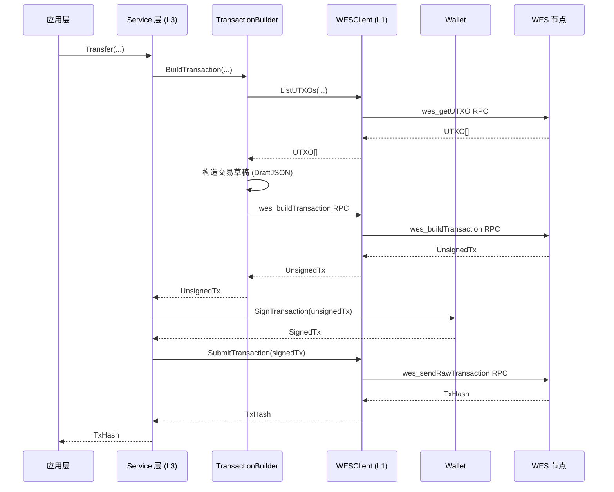

# WES 客户端应用开发指南 - Go SDK 视角

**版本**: v1.0.0  


---

## 📋 文档定位

> 📌 **重要说明**：本文档聚焦 **Go SDK 视角**的客户端应用开发指南。  
> 如需了解 WES 平台的核心概念、架构设计、交易模型等，请参考主仓库文档。

**本文档目标**：
- 说明如何使用 Go SDK 开发 WES 客户端应用
- 讲解常见开发模式（客户端初始化、业务服务使用、交易构建、事件订阅等）
- 提供从安装到部署的完整开发流程
- **引用平台文档**：平台概念（UTXO、交易模型等）请参考主仓库文档

**前置阅读**（平台级文档，来自主仓库）：
- [WES 系统架构文档](../../../weisyn.git/docs/system/architecture/1-STRUCTURE_VIEW.md) - 系统架构总览
- [JSON-RPC API 规范](../../../weisyn.git/docs/reference/json-rpc/) - API 规范说明
- [交易模型文档](../../../weisyn.git/docs/tutorials/transactions/) - UTXO 交易模型详解

---

## 🚀 快速开始

### 前置要求

- **Go 1.24+** - 用于开发环境

### 安装 SDK

```bash
go get github.com/weisyn/client-sdk-go@latest
```

在 `go.mod` 中：

```go
module your-app

go 1.24

require github.com/weisyn/client-sdk-go v0.0.0
```

### 第一个应用

```go
package main

import (
    "context"
    "fmt"
    "log"
    
    "github.com/weisyn/client-sdk-go/client"
    "github.com/weisyn/client-sdk-go/services/token"
    "github.com/weisyn/client-sdk-go/wallet"
)

func main() {
    // 1. 初始化客户端
    cfg := &client.Config{
        Endpoint: "http://localhost:28680/jsonrpc",
        Protocol: client.ProtocolHTTP,
    }
    cli, err := client.NewClient(cfg)
    if err != nil {
        log.Fatal(err)
    }
    defer cli.Close()
    
    // 2. 创建钱包
    w, err := wallet.NewWalletFromPrivateKey("0x...")
    if err != nil {
        log.Fatal(err)
    }
    
    // 3. 创建 Token 服务
    tokenService := token.NewServiceWithWallet(cli, w)
    
    // 4. 执行转账
    result, err := tokenService.Transfer(context.Background(), &token.TransferRequest{
        From:    w.Address(),
        To:      []byte{/* 接收方地址 */},
        Amount:  1000000, // 1 WES (假设 6 位小数)
        TokenID: nil,     // nil 表示原生币
    }, w)
    
    if err != nil {
        log.Fatalf("转账失败: %v", err)
    }
    
    fmt.Printf("转账成功！交易哈希: %s\n", result.TxHash)
}
```

---

## 📚 核心概念

### 1. 客户端初始化

SDK 支持三种传输协议：

```go
// HTTP 客户端（最常用）
client := client.NewClient(&client.Config{
    Endpoint: "http://localhost:28680/jsonrpc",
    Protocol: client.ProtocolHTTP,
    Timeout:  30,
})

// gRPC 客户端（高性能）
client := client.NewClient(&client.Config{
    Endpoint: "localhost:28682",
    Protocol: client.ProtocolGRPC,
})

// WebSocket 客户端（用于事件订阅）
client := client.NewClient(&client.Config{
    Endpoint: "ws://localhost:28681",
    Protocol: client.ProtocolWebSocket,
})
```

### 2. WESClient 类型化 API

`WESClient` 提供类型化的 RPC 封装，推荐使用：

```go
import "github.com/weisyn/client-sdk-go/client"

// 创建 WESClient
cfg := &client.Config{
    Endpoint: "http://localhost:28680/jsonrpc",
    Protocol: client.ProtocolHTTP,
}
wesClient, err := client.NewWESClient(cfg)
if err != nil {
    log.Fatal(err)
}
defer wesClient.Close()

// UTXO 操作
utxos, err := wesClient.ListUTXOs(ctx, address)

// 资源操作
resource, err := wesClient.GetResource(ctx, resourceID)
resources, err := wesClient.GetResources(ctx, &client.ResourceFilters{
    ResourceType: &client.ResourceTypeContract,
    Limit:        20,
})

// 交易操作
tx, err := wesClient.GetTransaction(ctx, txID)
txHistory, err := wesClient.GetTransactionHistory(ctx, &client.TransactionFilters{
    ResourceID: &resourceID,
    Limit:     100,
})

// 事件操作
events, err := wesClient.GetEvents(ctx, &client.EventFilters{
    ResourceID: &resourceID,
    Limit:     50,
})
```

### 3. 业务服务使用

所有业务服务都遵循相同的设计模式：

```go
// 创建服务实例（方式1：使用 WESClient）
wesClient, _ := client.NewWESClient(cfg)
tokenService := token.NewService(wesClient)

// 创建服务实例（方式2：使用底层 Client + Wallet）
cli, _ := client.NewClient(cfg)
wallet, _ := wallet.NewWalletFromPrivateKey("0x...")
tokenService := token.NewServiceWithWallet(cli, wallet)

// 调用业务方法
result, err := tokenService.Transfer(ctx, &token.TransferRequest{
    From:    wallet.Address(),
    To:      toAddr,
    Amount:  1000,
    TokenID: nil, // nil = 原生币
}, wallet)
```

### 4. 交易流程



---

## 🔧 开发模式

### 1. 客户端初始化模式

```go
// 单客户端模式
client := client.NewClient(&client.Config{
    Endpoint: "http://localhost:28680/jsonrpc",
    Protocol: client.ProtocolHTTP,
})

// 多客户端模式（HTTP + WebSocket）
httpClient := client.NewClient(&client.Config{
    Endpoint: "http://localhost:28680/jsonrpc",
    Protocol: client.ProtocolHTTP,
})

wsClient := client.NewClient(&client.Config{
    Endpoint: "ws://localhost:28681",
    Protocol: client.ProtocolWebSocket,
})
```

### 2. 业务服务使用模式

```go
// 模式 1：使用 WESClient（类型化 API，推荐）
wesClient := client.NewWESClient(cfg)
resourceService := resource.NewService(wesClient)
resources, err := resourceService.GetResources(ctx, filters)

// 模式 2：使用业务服务（业务语义 API）
tokenService := token.NewServiceWithWallet(client, wallet)
result, err := tokenService.Transfer(ctx, req, wallet)
```

### 3. 钱包管理模式

```go
// 创建新钱包
wallet, err := wallet.NewWallet()
if err != nil {
    log.Fatal(err)
}

// 从私钥创建钱包
wallet, err := wallet.NewWalletFromPrivateKey("0x...")
if err != nil {
    log.Fatal(err)
}

// 从 Keystore 加载钱包
wallet, err := wallet.LoadFromKeystore(keystorePath, password)
if err != nil {
    log.Fatal(err)
}

// 获取地址
address := wallet.Address() // 20 字节地址

// 签名交易
signedTx, err := wallet.SignTransaction(unsignedTxBytes)
if err != nil {
    log.Fatal(err)
}
```

### 4. 错误处理模式

```go
result, err := tokenService.Transfer(ctx, req, wallet)
if err != nil {
    // 检查错误类型
    var wesErr *client.WESClientError
    if errors.As(err, &wesErr) {
        switch wesErr.Code {
        case client.ErrCodeNetwork:
            // 网络错误处理（可重试）
            log.Printf("网络错误: %v", wesErr)
        case client.ErrCodeInvalidParams:
            // 参数错误处理（不可重试）
            log.Printf("参数错误: %v", wesErr)
        case client.ErrCodeRPC:
            // RPC 错误处理
            log.Printf("RPC 错误: %v", wesErr)
        default:
            // 其他错误处理
            log.Printf("未知错误: %v", wesErr)
        }
    } else {
        // 非 WESClientError 错误
        log.Printf("其他错误: %v", err)
    }
}
```

### 5. 事件订阅模式

```go
// 使用 WebSocket 客户端订阅事件
wsClient, _ := client.NewClient(&client.Config{
    Endpoint: "ws://localhost:28681",
    Protocol: client.ProtocolWebSocket,
})

wesClient, _ := client.NewWESClient(&client.Config{
    Endpoint: "ws://localhost:28681",
    Protocol: client.ProtocolWebSocket,
})

events, err := wesClient.SubscribeEvents(ctx, &client.EventFilters{
    Topics: []string{"Transfer", "Mint"},
    From:   fromAddr,
    To:     toAddr,
})

if err != nil {
    log.Fatal(err)
}

// 处理事件流
for event := range events {
    fmt.Printf("收到事件: %s, 数据: %x\n", event.Topic, event.Data)
}
```

---

## 📖 详细内容

### 1. 客户端初始化

#### 配置选项

```go
type Config struct {
    Endpoint string        // 节点地址
    Protocol Protocol      // 协议类型（HTTP/gRPC/WebSocket）
    Timeout  time.Duration // 超时时间
    Retry    *RetryConfig // 重试配置
    Logger   Logger       // 日志器（可选）
    Debug    bool         // 调试模式（可选）
}
```

#### 协议选择

- **HTTP**：最常用，适合大多数场景
- **gRPC**：高性能，适合服务器端应用（Go SDK 特有）
- **WebSocket**：实时事件订阅，适合需要实时数据的应用

### 2. WESClient 使用

#### UTXO 操作

```go
// 查询地址下的所有 UTXO
utxos, err := wesClient.ListUTXOs(ctx, address)
if err != nil {
    log.Fatal(err)
}

for _, utxo := range utxos {
    fmt.Printf("UTXO: %s:%d, 金额: %d\n", utxo.TxID, utxo.OutputIndex, utxo.Amount)
}
```

#### 资源操作

```go
// 查询单个资源
resource, err := wesClient.GetResource(ctx, resourceID)
if err != nil {
    log.Fatal(err)
}

// 查询资源列表（带过滤）
resources, err := wesClient.GetResources(ctx, &client.ResourceFilters{
    ResourceType: &client.ResourceTypeContract,
    Owner:        &ownerAddr,
    Limit:        20,
    Offset:       0,
})
```

#### 交易操作

```go
// 查询单个交易
tx, err := wesClient.GetTransaction(ctx, txID)
if err != nil {
    log.Fatal(err)
}

// 查询交易历史
txHistory, err := wesClient.GetTransactionHistory(ctx, &client.TransactionFilters{
    ResourceID: &resourceID,
    Limit:     100,
    Offset:    0,
})
```

### 3. 业务服务使用

#### Token 服务

```go
tokenService := token.NewServiceWithWallet(client, wallet)

// 单笔转账
result, err := tokenService.Transfer(ctx, &token.TransferRequest{
    From:    wallet.Address(),
    To:      toAddr,
    Amount:  1000,
    TokenID: nil, // nil = 原生币
}, wallet)

// 批量转账
result, err := tokenService.BatchTransfer(ctx, &token.BatchTransferRequest{
    From: wallet.Address(),
    Transfers: []token.TransferItem{
        {To: addr1, Amount: 100, TokenID: tokenID},
        {To: addr2, Amount: 200, TokenID: tokenID},
    },
}, wallet)

// 代币铸造
result, err := tokenService.Mint(ctx, &token.MintRequest{
    To:          recipientAddr,
    Amount:      10000,
    TokenID:     tokenID,
    ContractAddr: contractAddr,
}, wallet)

// 查询余额
balance, err := tokenService.GetBalance(ctx, address, tokenID)
```

#### Resource 服务

```go
resourceService := resource.NewService(wesClient)

// 部署合约（支持锁定条件）
result, err := resourceService.DeployContract(ctx, &resource.DeployContractRequest{
    From:         wallet.Address(),
    WasmContent:  wasmBytes,
    ContractName: "MyContract",
    InitArgs:     initArgs,
    LockingConditions: []resource.LockingCondition{
        {
            Type: resource.LockTypeSingleKey,
            Keys: [][]byte{wallet.Address()},
        },
    },
}, wallet)
```

### 4. 交易构建与签名

业务服务会自动处理交易构建和签名，开发者无需关心底层细节：

1. **构建交易草稿**：Service 层根据业务参数构建 `DraftJSON`
2. **调用节点 API**：调用 `wes_buildTransaction` 获取未签名交易
3. **Wallet 签名**：使用 Wallet 对交易进行签名
4. **完成交易**：调用 `wes_finalizeTransactionFromDraft` 完成交易
5. **提交交易**：调用 `wes_sendRawTransaction` 提交已签名交易

### 5. 事件订阅

```go
// 创建 WebSocket 客户端
wsClient, _ := client.NewWESClient(&client.Config{
    Endpoint: "ws://localhost:28681",
    Protocol: client.ProtocolWebSocket,
})

// 订阅事件
events, err := wsClient.SubscribeEvents(ctx, &client.EventFilters{
    ResourceID: &resourceID,
    EventName:  &eventName,
})

if err != nil {
    log.Fatal(err)
}

// 处理事件流
go func() {
    for event := range events {
        fmt.Printf("收到事件: %s, 数据: %x\n", event.Topic, event.Data)
    }
}()
```

### 6. 钱包管理

```go
// 创建新钱包
wallet, err := wallet.NewWallet()
if err != nil {
    log.Fatal(err)
}

// 保存到 Keystore
err = wallet.SaveToKeystore(keystorePath, password)
if err != nil {
    log.Fatal(err)
}

// 从 Keystore 加载
wallet, err := wallet.LoadFromKeystore(keystorePath, password)
if err != nil {
    log.Fatal(err)
}
```

### 7. 错误处理

```go
// WESClientError 统一错误类型
type WESClientError struct {
    Code    WESClientErrorCode
    Message string
    Cause   error
}

// 错误码
const (
    ErrCodeNetwork        WESClientErrorCode = "NETWORK_ERROR"
    ErrCodeRPC            WESClientErrorCode = "RPC_ERROR"
    ErrCodeInvalidParams  WESClientErrorCode = "INVALID_PARAMS"
    ErrCodeNotImplemented WESClientErrorCode = "RPC_NOT_IMPLEMENTED"
    ErrCodeNotFound       WESClientErrorCode = "NOT_FOUND"
    ErrCodeDecodeFailed   WESClientErrorCode = "DECODE_FAILED"
)
```

### 8. 性能优化

#### 连接池管理

```go
// HTTP 客户端自动管理连接池
client := client.NewClient(&client.Config{
    Endpoint: "http://localhost:28680/jsonrpc",
    Protocol: client.ProtocolHTTP,
    Timeout:  30,
})
```

#### 批量操作

```go
// 批量查询 UTXO（并发调用）
utxos, err := wesClient.BatchGetUTXOs(ctx, utxoIDs)

// 批量查询资源
resources, err := wesClient.BatchGetResources(ctx, resourceIDs)
```

---

## 🔗 相关文档

- [API 参考](./API_REFERENCE.md) - 详细的 API 文档
- [业务场景实现指南](./BUSINESS_SCENARIOS.md) - 业务场景实现示例
- [SDK 架构](./SDK_ARCHITECTURE.md) - SDK 架构设计
- [WES 系统架构文档](../../../weisyn.git/docs/system/architecture/1-STRUCTURE_VIEW.md) - 平台架构（主仓库）
- [Client API 设计](../_dev/CLIENT_API_DESIGN.md) - WESClient API 详细设计
- [Services 设计](../_dev/SERVICES_DESIGN.md) - 服务层详细设计

---

  
**维护者**: WES Core Team
