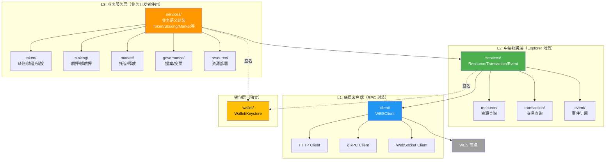
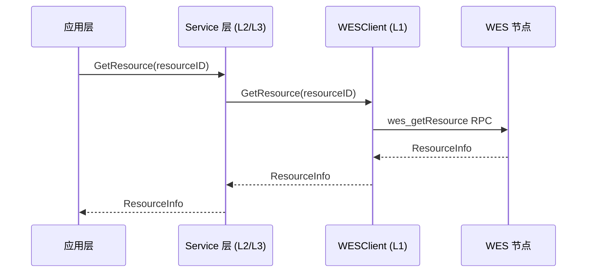
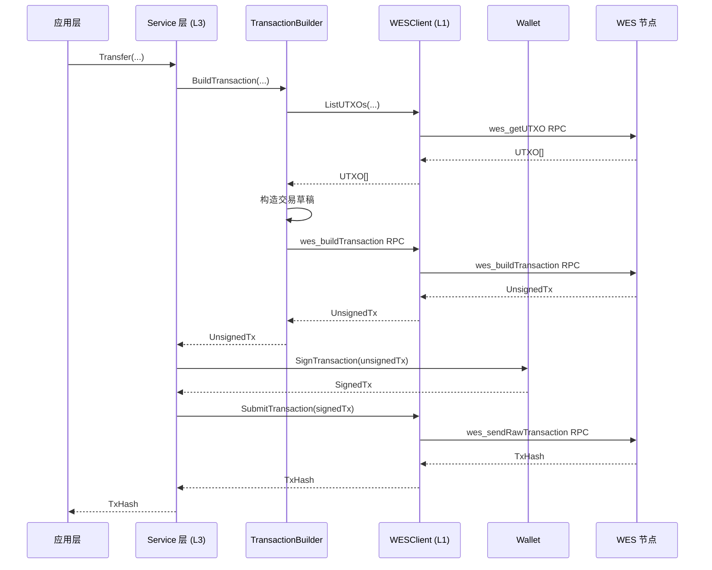

# Client SDK Go - SDK 内部架构

**版本**: v1.0.0  


---

## 📋 文档定位

> 📌 **重要说明**：本文档聚焦 **SDK 内部分层架构设计**。  
> 如需了解 WES 平台的整体架构，请参考主仓库文档。

**本文档目标**：
- 说明 SDK 内部分层架构（L1/L2/L3）
- 解释模块组织方式和依赖关系
- 记录设计决策

---

## 🏗️ 分层架构

### 整体分层图



### 层级职责

| 层级 | 目录 | 职责 | 使用者 |
|------|------|------|--------|
| **L3: 业务服务** | `services/token`、`services/staking`、`services/market`、`services/governance` | 业务语义封装（Transfer、Mint、Stake、Vote等） | 业务开发者 |
| **L2: 中层服务** | `services/resource`、`services/transaction`、`services/event` | Explorer 场景服务（资源查询、交易历史、事件订阅） | Workbench、Explorer 工具 |
| **L1: 底层客户端** | `client/` | WESClient RPC 封装、类型化 API | 所有 Service |
| **钱包层** | `wallet/` | 密钥管理、交易签名 | 所有 Service |

---

## 📦 模块结构

### 目录结构

```
client-sdk-go/
├── client/                      # L1: 底层客户端
│   ├── client.go                # Client 接口定义
│   ├── config.go                # 配置
│   ├── http.go                  # HTTP 客户端实现
│   ├── grpc.go                  # gRPC 客户端实现
│   ├── websocket.go             # WebSocket 客户端实现
│   ├── errors.go                # 错误定义
│   ├── retry.go                 # 重试机制
│   ├── types.go                 # 核心类型定义
│   └── mock/                    # Mock 客户端
│       └── mock.go
│
├── services/                    # L2/L3: 服务层
│   ├── resource/                # L2: 资源服务
│   │   ├── service.go
│   │   ├── query.go
│   │   └── deploy.go
│   ├── transaction/            # L2: 交易服务
│   │   ├── service.go
│   │   ├── query.go
│   │   └── history.go
│   ├── event/                   # L2: 事件服务
│   │   ├── service.go
│   │   ├── query.go
│   │   └── subscribe.go
│   ├── token/                   # L3: Token 服务
│   ├── staking/                 # L3: Staking 服务
│   ├── market/                  # L3: Market 服务
│   └── governance/             # L3: Governance 服务
│
├── utils/                       # 工具函数
│   ├── address.go               # 地址转换
│   ├── batch.go                 # 批量操作
│   └── file.go                  # 文件处理
│
├── wallet/                      # 钱包层（独立）
│   ├── wallet.go                # Wallet 接口和实现
│   └── keystore.go              # Keystore 管理器
│
├── docs/                        # 用户文档
└── _dev/                        # 开发文档
```

---

## 🔧 核心组件

### 1. WESClient (L1)

**职责**：
- 封装所有 RPC 调用，提供类型化方法
- 处理重试、超时、错误转换
- 支持 HTTP/gRPC/WebSocket 三种协议

**接口定义**：

```go
type WESClient interface {
    // UTXO 操作
    ListUTXOs(ctx context.Context, address []byte) ([]*UTXO, error)
    
    // 资源操作
    GetResource(ctx context.Context, resourceID [32]byte) (*ResourceInfo, error)
    GetResources(ctx context.Context, filters *ResourceFilters) ([]*ResourceInfo, error)
    
    // 交易操作
    GetTransaction(ctx context.Context, txID string) (*TransactionInfo, error)
    GetTransactionHistory(ctx context.Context, filters *TransactionFilters) ([]*TransactionInfo, error)
    SubmitTransaction(ctx context.Context, tx *Transaction) (*SubmitTxResult, error)
    
    // 事件操作
    GetEvents(ctx context.Context, filters *EventFilters) ([]*EventInfo, error)
    SubscribeEvents(ctx context.Context, filters *EventFilters) (<-chan *EventInfo, error)
    
    // 节点信息
    GetNodeInfo(ctx context.Context) (*NodeInfo, error)
    
    // 连接管理
    Close() error
}
```

### 2. Resource Service (L2)

**职责**：
- 资源查询（单个/列表）
- 资源部署（合约/模型/静态资源）
- 支持可执行资源锁定能力（7 种锁定条件）
- 为 Workbench Resource Explorer 提供数据

**接口定义**：

```go
type ResourceService interface {
    // 查询
    GetResource(ctx context.Context, resourceID [32]byte) (*ResourceInfo, error)
    GetResources(ctx context.Context, filters *ResourceFilters) ([]*ResourceInfo, error)
    
    // 部署
    DeployContract(ctx context.Context, req *DeployContractRequest, wallet wallet.Wallet) (*DeployContractResult, error)
    DeployAIModel(ctx context.Context, req *DeployAIModelRequest, wallet wallet.Wallet) (*DeployAIModelResult, error)
    DeployStaticResource(ctx context.Context, req *DeployStaticResourceRequest, wallet wallet.Wallet) (*DeployStaticResourceResult, error)
}
```

### 3. Transaction Service (L2)

**职责**：
- 交易查询（单个/历史）
- 交易提交
- 为 Workbench History Tab 提供数据

**接口定义**：

```go
type TransactionService interface {
    GetTransaction(ctx context.Context, txID string) (*TransactionInfo, error)
    GetTransactionHistory(ctx context.Context, filters *TransactionFilters) ([]*TransactionInfo, error)
    SubmitTransaction(ctx context.Context, tx *Transaction, wallet wallet.Wallet) (*SubmitTxResult, error)
}
```

### 4. Event Service (L2)

**职责**：
- 事件查询
- 事件订阅（WebSocket）
- 为 Workbench Events Tab 提供数据

**接口定义**：

```go
type EventService interface {
    GetEvents(ctx context.Context, filters *EventFilters) ([]*EventInfo, error)
    SubscribeEvents(ctx context.Context, filters *EventFilters) (<-chan *EventInfo, error)
}
```

### 5. 业务服务 (L3)

**Token Service**：
- Transfer：单笔转账
- BatchTransfer：批量转账
- Mint：代币铸造
- Burn：代币销毁
- GetBalance：余额查询

**Staking Service**：
- Stake：质押
- Unstake：解质押
- Delegate：委托
- Undelegate：取消委托
- ClaimReward：领取奖励

**Market Service**：
- SwapAMM：AMM 代币交换
- AddLiquidity：添加流动性
- RemoveLiquidity：移除流动性
- CreateVesting：创建归属计划
- CreateEscrow：创建托管

**Governance Service**：
- Propose：创建提案
- Vote：投票
- UpdateParam：更新参数

---

## 🔗 依赖关系

### 模块依赖

```
L3 业务服务 (token/staking/market/governance)
    ↓ 依赖
L2 中层服务 (resource/transaction/event)
    ↓ 依赖
L1 底层客户端 (client/WESClient)
    ↓ 依赖
WES 节点 (JSON-RPC/gRPC/WebSocket)

钱包层 (wallet/)
    ↓ 独立模块，被所有 Service 使用
```

### 依赖规则

- ✅ **L3 → L2 → L1**：业务服务依赖中层服务，中层服务依赖底层客户端
- ✅ **钱包层独立**：钱包层不依赖其他模块，可独立使用
- ✅ **工具层独立**：utils 层不依赖其他模块，提供通用工具函数
- ❌ **禁止循环依赖**：任何模块都不能形成循环依赖

---

## 📊 数据流

### 查询流程



### 交易流程



---

## 🎯 设计原则

### 1. 业务语义在 SDK 层

**核心架构理念**：WES 协议层提供基础能力，SDK 层实现业务语义。

- **WES 协议层**：提供固化的基础能力
  - 2种输入模式（AssetInput、ResourceInput）
  - 3种输出类型（AssetOutput、StateOutput、ResourceOutput）
  - 7种锁定条件（SingleKey、MultiKey、Contract、Delegation、Threshold、Time、Height）
  
- **SDK 层**：将基础能力组合成业务语义
  - 转账、质押、投票等业务操作 = 输入输出和锁定条件的组合
  - 所有业务语义都在 SDK 层实现，不依赖节点业务服务 API

### 2. 分层清晰

- **L1 层**：只负责 RPC 封装，不涉及业务逻辑
- **L2 层**：提供 Explorer 场景服务，不涉及具体业务语义
- **L3 层**：提供业务语义封装，组合 L1/L2 能力

### 3. 完全独立

- ✅ 不依赖任何 WES 内部包，可独立发布
- ✅ 通过 API（JSON-RPC/gRPC/WebSocket）与节点交互
- ✅ 只依赖 Go 标准库和通用第三方库

---

## 🔒 可执行资源锁定能力

### 三层锁定模型

可执行资源（智能合约、AI模型等）的锁定能力分为三个层次：

1. **L1: 资源所有权锁定** (`ResourceOutput.locking_conditions`)
   - 决定：谁可以升级/销毁/转移合约资源
   - 适用：SingleKey / MultiKey / TimeLock / HeightLock / DelegationLock / ContractLock / ThresholdLock

2. **L2: 调用访问控制** (`TxInput + AssetOutput + ContractLock`)
   - 决定：谁可以在什么条件下调用合约
   - 适用：ContractLock + ExecutionProof / DelegationLock

3. **L3: 应用级权限** (合约内部逻辑)
   - 决定：调用后，合约内部的业务权限控制
   - 适用：onlyOwner / onlyRole / 自定义权限逻辑

### 7种锁定条件

| 锁定类型 | 适用L1（所有权） | 适用L2（调用控制） | 典型场景 |
|---------|----------------|-----------------|---------|
| SingleKeyLock | ✅ 基础模式 | ✅ 简单调用 | 个人合约、PoC |
| MultiKeyLock | ✅ 组织治理 | ✅ 多签调用 | DAO协议、企业合约 |
| ContractLock | ⚠️ 高级（需防循环） | ✅ 付费/动态控制 | 治理合约、付费模型 |
| DelegationLock | ✅ 临时授权 | ✅ 代理调用 | 平台托管、外包维护 |
| ThresholdLock | ✅ 银行级安全 | ✅ 高安全调用 | 央行合约、核心清算 |
| TimeLock | ✅ 时间窗口 | ✅ 定时调用 | 锁仓升级、定期发布 |
| HeightLock | ✅ 区块窗口 | ✅ 高度控制 | 分阶段升级、里程碑 |

> 📖 **详细设计**：参见 [可执行资源锁定能力设计](../../workbench/contract-workbench.git/_dev/EXECUTABLE_RESOURCE_LOCKING_DESIGN.md)

---

## 🔗 相关文档

- [应用场景分析](./APPLICATION_SCENARIOS_ANALYSIS.md) - SDK 职责边界
- [架构规划](./ARCHITECTURE_PLAN.md) - 未来演进方向
- [WES 系统架构文档](../../../weisyn.git/docs/system/architecture/1-STRUCTURE_VIEW.md) - 平台架构（主仓库）
- [Client API 设计](../_dev/CLIENT_API_DESIGN.md) - WESClient API 详细设计
- [Services 设计](../_dev/SERVICES_DESIGN.md) - 服务层详细设计

---

  
**维护者**: WES Core Team
