# SDK 架构设计

本文档说明 WES Client SDK for Go 的架构设计，包括在 WES 7 层架构中的位置和 SDK 内部的分层设计。

## 📐 在 WES 7 层架构中的位置

`client-sdk-go` 位于 WES 系统的**应用层 & 开发者生态**中的 **SDK 工具链**，通过 **API 网关层**与 WES 节点交互。

### WES 7 层架构（精简版）

```mermaid
graph TB
    subgraph DEV_ECOSYSTEM["🎨 应用层 & 开发者生态 - Application & Developer Ecosystem"]
        direction TB
        subgraph SDK_LAYER["SDK 工具链"]
            direction LR
            CLIENT_SDK["Client SDK<br/>Go/JS/Python/Java<br/>📱 DApp·钱包·浏览器<br/>⭐ client-sdk-go<br/>链外应用开发"]
            CONTRACT_SDK["Contract SDK (WASM)<br/>Go/Rust/AS/C<br/>📜 智能合约开发<br/>链上合约开发<br/>github.com/weisyn/contract-sdk-go"]
            AI_SDK["AI SDK (ONNX)<br/>Python/Go<br/>🤖 模型部署·推理"]
        end
        subgraph END_USER_APPS["终端应用"]
            direction LR
            CLI["CLI<br/>节点运维·钱包·调试"]
            WALLET["Wallet<br/>钱包应用"]
            EXPLORER["Explorer<br/>区块浏览器"]
            DAPP["DApp<br/>去中心化应用"]
        end
    end
    
    subgraph API_GATEWAY["🌐 API 网关层 - internal/api"]
        direction LR
        JSONRPC["JSON-RPC 2.0<br/>:8545<br/>主协议·DApp·CLI"]
        HTTP["HTTP REST<br/>/api/v1/*<br/>人类友好·运维"]
        GRPC["gRPC<br/>:9090<br/>高性能 RPC"]
        WS["WebSocket<br/>:8081<br/>实时事件订阅"]
    end
    
    subgraph BIZ_LAYER["💼 业务服务层 - Business Service Layer"]
        direction TB
        APP_SVC["App Service<br/>应用编排·生命周期"]
        BLOCKCHAIN_SVC["Blockchain<br/>区块·链·同步"]
        CONSENSUS_SVC["Consensus<br/>PoW+XOR 共识"]
        MEMPOOL_SVC["Mempool<br/>双池管理"]
        NETWORK_SVC["Network<br/>P2P 通信"]
    end
    
    subgraph IF_LAYER["📦 公共接口层 - pkg/interfaces"]
        CHAIN_IF["chain/<br/>链·分叉·同步"]
        BLOCK_IF["block/<br/>区块·验证"]
        TX_IF["tx/<br/>交易构建·验证"]
        UTXO_IF["utxo/<br/>EUTXO·状态管理"]
        URES_IF["ures/<br/>资源·CAS"]
        ISPC_IF["ispc/<br/>合约执行·HostABI"]
    end
    
    WALLET --> CLIENT_SDK
    EXPLORER --> CLIENT_SDK
    DAPP --> CLIENT_SDK
    
    CLIENT_SDK --> JSONRPC
    CLIENT_SDK --> HTTP
    CLIENT_SDK --> GRPC
    CLIENT_SDK --> WS
    
    JSONRPC --> APP_SVC
    HTTP --> APP_SVC
    GRPC --> APP_SVC
    WS --> APP_SVC
    
    APP_SVC --> CHAIN_IF
    APP_SVC --> TX_IF
    BLOCKCHAIN_SVC --> BLOCK_IF
    BLOCKCHAIN_SVC --> TX_IF
    
    TX_IF --> ISPC_IF
    TX_IF --> UTXO_IF
    ISPC_IF --> URES_IF
    
    style CLIENT_SDK fill:#81C784,color:#fff,stroke:#4CAF50,stroke-width:3px
    style API_GATEWAY fill:#64B5F6,color:#fff
    style BIZ_LAYER fill:#FFB74D,color:#333
    style IF_LAYER fill:#9C27B0,color:#fff
```



> 📖 **完整 WES 架构**：详见 [WES 系统架构文档](https://github.com/weisyn/go-weisyn/blob/main/docs/system/architecture/1-STRUCTURE_VIEW.md)

### SDK 的职责边界

**Client SDK 的职责**：
- ✅ 封装 JSON-RPC/HTTP/gRPC/WebSocket 调用
- ✅ 提供业务语义 API（Token、Staking、Market 等）
- ✅ 交易构建与签名（Draft+Hash+Finalize）
- ✅ 钱包管理（密钥、签名）

**Client SDK 不负责**：
- ❌ 链上执行（由 WES 节点负责）
- ❌ 共识机制（由 WES 节点负责）
- ❌ 区块验证（由 WES 节点负责）

## 🏗️ SDK 内部分层架构

在 SDK 仓库内部，采用清晰的分层设计：

```mermaid
graph TB
    subgraph APP_LAYER["应用层 (DApp)"]
        direction LR
        WALLET_APP["钱包应用"]
        DAPP_FRONT["DApp 前端"]
        BACKEND["后端服务"]
    end
    
    subgraph SERVICES_LAYER["业务服务层 (services/)"]
        direction LR
        TOKEN["Token<br/>转账·铸造·销毁"]
        STAKING["Staking<br/>质押·委托"]
        MARKET["Market<br/>交换·流动性"]
        GOVERNANCE["Governance<br/>提案·投票"]
        RESOURCE["Resource<br/>部署·查询"]
    end
    
    subgraph CLIENT_LAYER["核心客户端层 (client/)"]
        direction LR
        HTTP_CLIENT["HTTP<br/>最常用"]
        GRPC_CLIENT["gRPC<br/>高性能"]
        WS_CLIENT["WebSocket<br/>实时事件"]
    end
    
    subgraph WALLET_LAYER["钱包层 (wallet/)"]
        direction LR
        WALLET["Wallet<br/>接口实现"]
        KEYSTORE["Keystore<br/>加密存储"]
    end
    
    subgraph UTILS_LAYER["工具层 (utils/)"]
        direction LR
        ADDRESS["地址转换"]
        PARSER["交易解析"]
    end
    
    subgraph NODE["WES 节点"]
        JSONRPC_API["JSON-RPC API<br/>(HTTP/gRPC/WebSocket)"]
    end
    
    APP_LAYER --> SERVICES_LAYER
    SERVICES_LAYER --> CLIENT_LAYER
    SERVICES_LAYER --> WALLET_LAYER
    SERVICES_LAYER --> UTILS_LAYER
    CLIENT_LAYER --> NODE
    WALLET_LAYER -.签名.-> SERVICES_LAYER
    
    style SERVICES_LAYER fill:#4CAF50,color:#fff
    style CLIENT_LAYER fill:#2196F3,color:#fff
    style WALLET_LAYER fill:#FF9800,color:#fff
    style UTILS_LAYER fill:#9E9E9E,color:#fff
    style NODE fill:#9C27B0,color:#fff
```



### 分层职责

| 层次 | 职责 | 关键特性 |
|------|------|---------|
| **业务服务层** | 提供业务语义 API | Token、Staking、Market、Governance、Resource |
| **核心客户端层** | 封装协议调用 | HTTP、gRPC、WebSocket |
| **钱包层** | 密钥管理与签名 | Wallet 接口、Keystore 加密存储 |
| **工具层** | 辅助功能 | 地址转换、交易解析 |

## 🔄 调用流程

### 完整交易流程

```mermaid
sequenceDiagram
    participant App as 应用层
    participant Service as 业务服务层
    participant Client as 客户端层
    participant Wallet as 钱包层
    participant Node as WES 节点
    
    App->>Service: tokenService.Transfer(req, wallet)
    Service->>Service: 1. 参数验证
    Service->>Service: 2. 构建交易草稿 (DraftJSON)
    Service->>Client: 3. wes_buildTransaction(draft)
    Client->>Node: JSON-RPC 调用
    Node-->>Client: 返回 unsignedTx
    Client-->>Service: unsignedTx
    Service->>Client: 4. wes_computeSignatureHashFromDraft(draft, inputIndex)
    Client->>Node: JSON-RPC 调用
    Node-->>Client: 返回 hash
    Client-->>Service: hash
    Service->>Wallet: 5. wallet.SignHash(hash)
    Wallet-->>Service: signature
    Service->>Client: 6. wes_finalizeTransactionFromDraft(draft, signature)
    Client->>Node: JSON-RPC 调用
    Node-->>Client: 返回 signedTx
    Client-->>Service: signedTx
    Service->>Client: 7. wes_sendRawTransaction(signedTx)
    Client->>Node: JSON-RPC 调用
    Node-->>Client: 返回 txHash
    Client-->>Service: txHash
    Service-->>App: TransferResult{TxHash, Success}
```



## 🎯 设计原则

### 1. SDK 独立性

**允许**：
- ✅ Go 标准库
- ✅ 第三方通用库（如 `gorilla/websocket`）
- ✅ 通过 API 与节点交互

**禁止**：
- ❌ `github.com/weisyn/v1/pkg/*`
- ❌ `github.com/weisyn/v1/internal/*`
- ❌ 任何 WES 内部包

### 2. 业务语义在 SDK 层

```
SDK 层 (业务语义)
  ├─> tokenService.Transfer()
  ├─> tokenService.Mint()
  └─> stakingService.Stake()
       ↓ 调用
API 层 (通用接口)
  ├─> wes_buildTransaction
  ├─> wes_callContract
  └─> wes_sendRawTransaction
       ↓ 调用
ISPC 层 (执行引擎)
  └─> ExecuteWASMContract (纯执行)
```

### 3. Wallet 接口抽象

所有业务服务都通过 `wallet.Wallet` 接口进行签名，确保：
- ✅ 私钥不离开钱包
- ✅ 支持多种钱包实现（SimpleWallet、Keystore）
- ✅ 未来可扩展硬件钱包

## 🧱 架构边界与职责划分

### SDK 与 WES 内核的边界

**禁止依赖 WES 内部包**：
- ❌ `github.com/weisyn/v1/internal/...`
- ❌ `github.com/weisyn/v1/pkg/interfaces/...`
- ❌ `github.com/weisyn/v1/pb/...`（protobuf 类型）

**SDK 只依赖**：
- ✅ Go 标准库
- ✅ 通用第三方库（如 `grpc`、`btcsuite/btcutil`、`testify` 等）

**只通过 API 访问节点**：
- ✅ JSON-RPC 2.0（主协议）
- ✅ HTTP REST（健康检查、资源查询）
- ✅ WebSocket（事件订阅）
- ✅ gRPC（高性能场景）

**SDK 职责**：
- ✅ 私钥管理（keystore、内存钱包）
- ✅ 网络通信（HTTP/gRPC/WebSocket 客户端）
- ✅ 高层业务语义封装（Token / Staking / Market / Governance / Resource）
- ✅ 交易构建（DraftJSON）

**WES 节点职责**：
- ✅ DraftJSON 解析与验证
- ✅ UTXO 选择、锁定条件
- ✅ SignatureHash 计算
- ✅ 交易提交与验证

> 📖 **详细边界说明**：参见 [`architecture_boundary.md`](architecture_boundary.md)

## 📚 相关文档

- [WES 系统架构](https://github.com/weisyn/go-weisyn/blob/main/docs/system/architecture/1-STRUCTURE_VIEW.md) - 完整 WES 7 层架构
- [业务服务文档](modules/services.md) - 业务服务层详细说明
- [钱包文档](modules/wallet.md) - 钱包功能详细说明

---

**最后更新**: 2025-11-17

