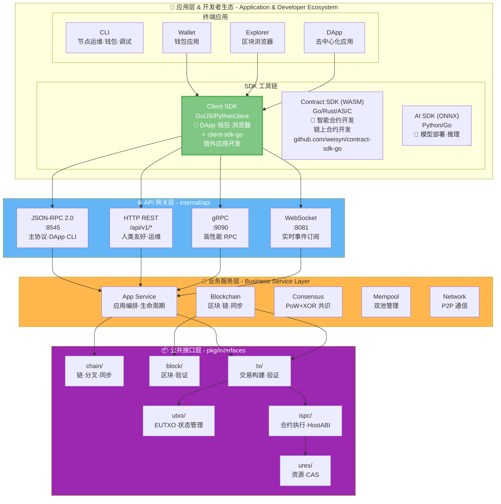
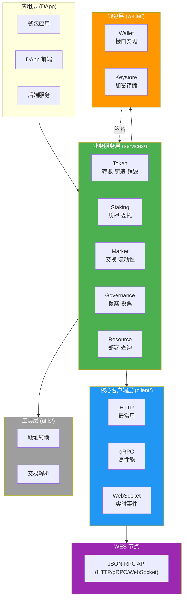
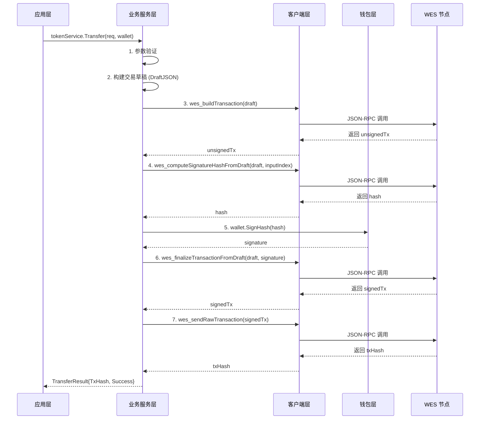

# SDK 架构设计

---

## 📌 版本信息

- **版本**：0.1.0-alpha
- **状态**：draft
- **最后更新**：2025-11-17
- **最后审核**：2025-11-17
- **所有者**：SDK 团队
- **适用范围**：Go 客户端 SDK（已归档）

---

## 📖 概述

本文档说明 WES Client SDK for Go 的架构设计，包括在 WES 7 层架构中的位置和 SDK 内部的分层设计。

## 📐 在 WES 7 层架构中的位置

`client-sdk-go` 位于 WES 系统的**应用层 & 开发者生态**中的 **SDK 工具链**，通过 **API 网关层**与 WES 节点交互。

### WES 7 层架构（精简版）



> 📖 **完整 WES 架构**：详见 [WES 系统架构文档](https://github.com/weisyn/go-weisyn/blob/main/docs/system/architecture/1-STRUCTURE_VIEW.md)

### SDK 的职责边界

**Client SDK 的职责**：
- ✅ 封装 JSON-RPC/HTTP/gRPC/WebSocket 调用
- ✅ 提供业务语义 API（Token、Staking、Market 等）
- ✅ 交易构建与签名（Draft+Hash+Finalize）
- ✅ 钱包管理（密钥、签名）

**Client SDK 不负责**：
- ❌ 链上执行（由 WES 节点负责）
- ❌ 共识机制（由 WES 节点负责）
- ❌ 区块验证（由 WES 节点负责）

## 🏗️ SDK 内部分层架构

在 SDK 仓库内部，采用清晰的分层设计：



### 分层职责

| 层次 | 职责 | 关键特性 |
|------|------|---------|
| **业务服务层** | 提供业务语义 API | Token、Staking、Market、Governance、Resource |
| **核心客户端层** | 封装协议调用 | HTTP、gRPC、WebSocket |
| **钱包层** | 密钥管理与签名 | Wallet 接口、Keystore 加密存储 |
| **工具层** | 辅助功能 | 地址转换、交易解析 |

## 🔄 调用流程

### 完整交易流程



## 🎯 设计原则

### 1. SDK 独立性

**允许**：
- ✅ Go 标准库
- ✅ 第三方通用库（如 `gorilla/websocket`）
- ✅ 通过 API 与节点交互

**禁止**：
- ❌ `github.com/weisyn/v1/pkg/*`
- ❌ `github.com/weisyn/v1/internal/*`
- ❌ 任何 WES 内部包

### 2. 业务语义在 SDK 层

```
SDK 层 (业务语义)
  ├─> tokenService.Transfer()
  ├─> tokenService.Mint()
  ├─> stakingService.Stake()
  ├─> marketService.SwapAMM()
  ├─> governanceService.Propose()
  └─> resourceService.DeployContract()
       ↓ 调用
API 层 (通用接口)
  ├─> wes_buildTransaction
  ├─> wes_callContract
  └─> wes_sendRawTransaction
       ↓ 调用
ISPC 层 (执行引擎)
  └─> ExecuteWASMContract (纯执行)
```

### 3. Wallet 接口抽象

所有业务服务都通过 `wallet.Wallet` 接口进行签名，确保：
- ✅ 私钥不离开钱包
- ✅ 支持多种钱包实现（SimpleWallet、Keystore）
- ✅ 未来可扩展硬件钱包

## 🧱 架构边界与职责划分

### SDK 与 WES 内核的边界

**禁止依赖 WES 内部包**：
- ❌ `github.com/weisyn/v1/internal/...`
- ❌ `github.com/weisyn/v1/pkg/interfaces/...`
- ❌ `github.com/weisyn/v1/pb/...`（protobuf 类型）

**SDK 只依赖**：
- ✅ Go 标准库
- ✅ 通用第三方库（如 `grpc`、`btcsuite/btcutil`、`testify` 等）

**只通过 API 访问节点**：
- ✅ JSON-RPC 2.0（主协议）
- ✅ HTTP REST（健康检查、资源查询）
- ✅ WebSocket（事件订阅）
- ✅ gRPC（高性能场景）

**SDK 职责**：
- ✅ 私钥管理（keystore、内存钱包）
- ✅ 网络通信（HTTP/gRPC/WebSocket 客户端）
- ✅ 高层业务语义封装（Token / Staking / Market / Governance / Resource）
- ✅ 交易构建（DraftJSON）

**WES 节点职责**：
- ✅ DraftJSON 解析与验证
- ✅ UTXO 选择、锁定条件
- ✅ SignatureHash 计算
- ✅ 交易提交与验证

> 📖 **详细边界说明**：参见 [`architecture_boundary.md`](architecture_boundary.md)

## 📚 相关文档

- [WES 系统架构](https://github.com/weisyn/go-weisyn/blob/main/docs/system/architecture/1-STRUCTURE_VIEW.md) - 完整 WES 7 层架构
- [业务服务文档](modules/services.md) - 业务服务层详细说明
- [钱包文档](modules/wallet.md) - 钱包功能详细说明

---

**最后更新**: 2025-11-17

